# Software Requirements Specification (SRS)
## Sistem Informasi Manajemen Casting Talent dan Extras Berbasis Web dengan Fitur Negosiasi Fee Digital
### Studi Kasus: JBTB Casting

> **⚠️ SUPERSEDED.** Dokumen ini mendeskripsikan desain lama (3 aktor, fee fixed dengan 1x counter-offer, TTD upload scan, storage Google Drive) yang sudah digantikan. Acuan terkini: `docs/BAB-3-DRAFT.md` dan `docs/CLAUDE.md` (7 aktor, nego fee ala InDrive tanpa batas ronde, canvas signature, private local disk). Jangan jadikan dasar implementasi.

**Format:** Mengikuti struktur modern IEEE 29148:2018 (Software and Systems Engineering — Requirements Engineering)
**Versi:** 1.0 (Final — konsolidasi dari seluruh dokumen analisis)
**Tanggal:** 17 Juli 2026

---

# 1. Introduction

## 1.1 Purpose
Dokumen ini mendefinisikan kebutuhan perangkat lunak (*software requirements*) untuk **Sistem Informasi Manajemen Casting Talent dan Extras Berbasis Web dengan Fitur Negosiasi Fee Digital** (disingkat **SIM Casting JBTB**), sebagai acuan tunggal (*single source of truth*) bagi tahap perancangan, implementasi, dan pengujian, serta sebagai bahan penyusunan skripsi.

## 1.2 Document Conventions
- **RF-xx** = Kebutuhan Fungsional (*Functional Requirement*)
- **RNF-xx** = Kebutuhan Non-Fungsional (*Non-Functional Requirement*)
- **UC-xx** = Use Case
- Kata *"harus"/"wajib"* menandakan kebutuhan mandatori; *"dapat"/"boleh"* menandakan kebutuhan opsional.

## 1.3 Intended Audience
Dosen pembimbing/penguji skripsi, pengembang sistem (jika dilanjutkan ke implementasi), dan pihak JBTB Casting sebagai pemilik proses bisnis.

## 1.4 Glossary

| Istilah | Definisi |
|---|---|
| Extras | Talent figuran yang mendaftar pada proyek casting |
| CD | Casting Director — pihak yang menyetujui/menolak kandidat |
| PH | Production House — pihak eksternal, bukan aktor sistem |
| Deal | Status ketika fee telah disepakati kedua pihak |
| TTD | Tanda tangan (dalam konteks ini: unggah dokumen hasil tanda tangan manual/scan) |
| SLA | Service Level Agreement — batas waktu respons internal sistem |
| LRS | Logical Record Structure — struktur tabel fisik hasil transformasi ERD |
| RBAC | Role-Based Access Control |

## 1.5 References
Dokumen ini mengonsolidasikan: Kebutuhan Fungsional & Non-Fungsional, Aktor & Use Case, Use Case/Activity/Sequence Diagram, ERD, Addendum 1–3 (Gap Closure), dan Requirement Baseline Summary v2 yang telah disusun sebelumnya dalam proses analisis.

---

# 2. System Objectives

1. Menggantikan proses rekrutmen manual (WhatsApp, Excel, Google Drive) dengan sistem terpusat berbasis web.
2. Mempercepat proses seleksi extras melalui alur review dan approval yang terstruktur, dengan SLA terukur.
3. Menghilangkan kesalahpahaman fee melalui mekanisme negosiasi fee digital yang transparan dan tercatat.
4. Memusatkan penyimpanan data extras, proyek, dan dokumen kontrak agar tidak tersebar/hilang.
5. Mempercepat penyampaian informasi ke extras melalui notifikasi berjenjang (email, web push, link grup WA).
6. Menyediakan jejak audit (*audit trail*) pada modul-modul sensitif (fee, kontrak, akun) untuk akuntabilitas.

---

# 3. Scope

## 3.1 In-Scope
- Manajemen akun & profil **Extras** (bukan talent profesional).
- Manajemen proyek casting oleh Admin Agensi.
- Alur seleksi kandidat oleh Casting Director.
- Negosiasi fee digital (fixed fee + 1x pengajuan alternatif).
- Kontrak digital (generate PDF dari template dinamis + unggah dokumen ber-TTD manual/scan).
- Notifikasi (email, web push, link grup WA manual).
- Dashboard & laporan/rekap per role.
- Audit log pada modul Fee, Kontrak, dan Manajemen Akun.

## 3.2 Out-of-Scope (Batasan Sistem)

1. Tidak mencakup talent profesional/artis utama — hanya extras/figuran.
2. Production House (PH) tidak memiliki akun; berinteraksi dengan sistem secara offline melalui Admin.
3. Sistem tidak memproses pembayaran (bukan payment gateway) — fee dibayar via transfer bank di luar sistem.
4. Tanda tangan digital berupa unggah dokumen hasil TTD manual/scan, bukan e-signature tersertifikasi (PSrE).
5. Jadwal shooting hanya field informasi sederhana, bukan modul penjadwalan produksi penuh (call sheet, shift kru, dll.).
6. Berbasis web sepenuhnya — tidak ada aplikasi mobile native.
7. Tidak mencakup modul payroll/akuntansi agensi secara menyeluruh.
8. Tidak ada fitur rating/review performa extras pasca-produksi (saran pengembangan).
9. Validasi NIK hanya internal (tidak terintegrasi Dukcapil).
10. Hanya 1 tingkatan Admin Agensi (tanpa sub-role).
11. Grup WhatsApp bersifat manual (link diinput Admin), tanpa integrasi API WhatsApp otomatis.
12. Tidak ada SMS sebagai kanal notifikasi.
13. Data disimpan dengan masa retensi 1 tahun.
14. Storage dokumen menggunakan Google Drive (satu-satunya integrasi API pihak ketiga wajib, di luar SMTP Gmail).

---

# 4. Stakeholder Analysis

| Stakeholder | Kepentingan | Pengaruh | Keterlibatan |
|---|---|---|---|
| **Admin Agensi** | Operasional harian sistem, efisiensi proses rekrutmen | Tinggi | Pengguna utama, sumber requirement bisnis |
| **Casting Director** | Kecepatan & kemudahan review kandidat | Sedang | Pengguna aktif pada modul seleksi |
| **Extras** | Transparansi fee, kejelasan status, kemudahan pendaftaran | Sedang | Pengguna publik/self-register |
| **Production House (PH)** | Mendapat kandidat sesuai kriteria tepat waktu | Rendah (tidak langsung) | Tidak berinteraksi langsung dengan sistem |
| **Pemilik JBTB Casting** | Efisiensi bisnis, reputasi agensi, minim sengketa fee | Tinggi | Pemberi keputusan bisnis akhir |
| **Peneliti/Penulis Skripsi** | Validitas akademik rancangan sistem | Tinggi | Pengembang dokumen & (opsional) sistem |

---

# 5. As-Is Process

Proses rekrutmen extras saat ini di JBTB Casting sepenuhnya manual:

1. PH menyampaikan kebutuhan casting ke Admin secara langsung/WA.
2. Admin membagikan info ke grup WhatsApp berisi calon extras.
3. Calon extras mengirim data & portofolio manual (chat, foto, dokumen) via WA.
4. Admin merekap data secara manual di Excel dan menyimpan dokumen di Google Drive.
5. Admin mengirim kandidat ke CD melalui chat/dokumen presentasi (Slidego), menunggu keputusan tanpa SLA yang jelas.
6. Negosiasi fee dilakukan personal via chat, rawan kesalahpahaman karena tidak terdokumentasi baku.
7. Kontrak/kesepakatan sering tidak terdokumentasi formal.
8. Info final ke extras yang lolos kerap disampaikan mendadak karena proses berjenjang yang lambat.

**Masalah utama:** proses lambat, kesalahpahaman fee, data tersebar/hilang, keputusan CD lambat, informasi dadakan ke extras.

---

# 6. To-Be Process

Sistem baru mengubah proses menjadi alur digital terstruktur dengan *state machine* baku:

```
Diajukan → Direview CD [SLA 2 hari, indikator "Terlambat"]
        → Lolos / Ditolak
Lolos → Nego Fee [SLA 24 jam, "Tidak Merespons" jika lewat]
      → Deal → "Cadangan (Back Up)" / "Ditolak (Kuota Penuh)" jika kuota terpenuhi
Deal → Kontrak Digenerate → Verifikasi Admin → Kontrak Ditandatangani (immutable)
Deal / Kontrak Ditandatangani → Dibatalkan (< H-2 dari shooting = "mendadak")
Proyek Ditutup Paksa → sisa pendaftar aktif → Dibatalkan Sistem
```

Detail lengkap tersedia pada bagian **UML Documentation** (Activity & Sequence Diagram).

---

# 7. Functional Requirements

Total **70 Kebutuhan Fungsional**, dikelompokkan per modul.

## 7.1 Modul Autentikasi & Akun
| Kode | Deskripsi |
|---|---|
| RF-01 | Registrasi mandiri (self-register) Extras dengan data diri, foto, portofolio, video profil |
| RF-02 | Login dengan hak akses berbeda untuk Admin, CD, Extras |
| RF-03 | Validasi duplikasi NIK (internal) saat Extras dinyatakan lolos |
| RF-04 | Admin mengelola akun CD (tambah/edit/nonaktifkan) |
| RF-05 | Admin menonaktifkan akun Extras secara manual |
| RF-36 | Verifikasi email wajib sebelum akun Extras aktif |
| RF-37 | Fitur *forgot password* via email untuk seluruh aktor |
| RF-38 | CAPTCHA pada form registrasi & login |
| RF-57 | Kebijakan password: minimal 8 karakter, 1 kapital, 1 angka, 1 simbol |
| RF-58 | Akun terkunci setelah 3x percobaan login gagal; dibuka via reset password/Admin |
| RF-59 | Audit log hanya dapat diakses Admin |

## 7.2 Modul Profil Extras
| Kode | Deskripsi |
|---|---|
| RF-06 | Extras melengkapi profil: usia, gender, tinggi, ukuran baju, warna kulit, pengalaman, bahasa, video profil |
| RF-07 | Sistem menampilkan status keaktifan Extras |
| RF-08 | Sistem menandai "Melanggar" otomatis jika 3x pembatalan mendadak di proyek berbeda |
| RF-54 | Extras di bawah 17 tahun wajib unggah dokumen persetujuan orang tua/wali |
| RF-62 | Pasca "Lolos", Extras hanya boleh edit foto grid & video profil, data lain terkunci |

## 7.3 Modul Manajemen Proyek Casting
| Kode | Deskripsi |
|---|---|
| RF-09 | Admin membuat proyek casting (nama produksi, kuota, kriteria, deadline, jadwal shooting) |
| RF-10 | Admin mengedit/menutup proyek casting |
| RF-11 | Sistem menampilkan proyek casting yang masih dibuka ke Extras |
| RF-56 | Jika deadline lewat & kuota belum penuh: Admin pilih tutup/perpanjang/otomatis tertutup |

## 7.4 Modul Pendaftaran & Seleksi
| Kode | Deskripsi |
|---|---|
| RF-12 | Extras mendaftar pada proyek casting (paralel diperbolehkan) |
| RF-13 | Admin memfilter pendaftar sesuai kriteria proyek |
| RF-14 | Admin mengajukan kandidat terfilter ke CD |
| RF-15 | CD melakukan approve/reject kandidat |
| RF-16 | Sistem mencatat status pendaftar berjenjang |
| RF-41 | SLA review CD maksimal 2 hari, indikator "Terlambat" jika lewat |
| RF-42 | Validasi kuota; kelebihan pendaftar → "Cadangan (Back Up)"/"Ditolak (Kuota Penuh)" |
| RF-55 | Validasi bentrok jadwal shooting; rekomendasi otomatis kandidat pengganti ke CD |

## 7.5 Modul Negosiasi Fee Digital
| Kode | Deskripsi |
|---|---|
| RF-17 | Admin mengajukan fee tetap ke Extras |
| RF-18 | Extras Terima atau Ajukan Fee Alternatif (maks. 1x) |
| RF-19 | Admin memutuskan final atas fee alternatif |
| RF-20 | Sistem mencatat riwayat negosiasi fee |
| RF-40 | SLA respons Extras 24 jam; lewat → "Tidak Merespons" |
| RF-60 | Konfirmasi pembayaran fee 2 langkah: Admin tandai transfer → Extras konfirmasi terima |

## 7.6 Modul Kontrak Digital
| Kode | Deskripsi |
|---|---|
| RF-21 | Admin membuat/edit template kontrak dinamis |
| RF-22 | Sistem *auto-generate* PDF kontrak dari template |
| RF-23 | Admin unggah PDF ber-TTD Admin |
| RF-24 | Extras unggah PDF ber-TTD lengkap |
| RF-25 | Sistem mengarsipkan dokumen kontrak final |
| RF-50 | Dokumen kontrak final bersifat immutable setelah "Kontrak Ditandatangani" |
| RF-61 | Status final kontrak wajib melalui verifikasi/approval Admin sebelum immutable |
| RF-68 | Data tidak lengkap → proses generate PDF dibatalkan, diminta melengkapi data |

## 7.7 Modul Pembatalan
| Kode | Deskripsi |
|---|---|
| RF-26 | Admin/Extras mengajukan pembatalan dengan alasan |
| RF-27 | Sistem mencatat riwayat pembatalan & akumulasi |
| RF-43 | Pembatalan < H-2 sebelum shooting = "mendadak" |

## 7.8 Modul Notifikasi
| Kode | Deskripsi |
|---|---|
| RF-28 | Notifikasi email: hasil seleksi, konfirmasi fee, kontrak siap TTD |
| RF-29 | Admin input link grup WA per proyek |
| RF-39 | Web Push Notification sebagai kanal tambahan |
| RF-48 | Notifikasi pengingat H-3 & H-1 sebelum deadline terkait |
| RF-64 | Notifikasi ke CD saat kandidat baru diajukan |
| RF-65 | Notifikasi aktif ke Admin saat pelanggaran SLA |
| RF-66 | Notifikasi ke Extras saat berstatus "Cadangan (Back Up)" |

## 7.9 Modul Dashboard
| Kode | Deskripsi |
|---|---|
| RF-30 | Dashboard Admin (ringkasan proyek, CD, extras, pendaftar, jadwal, indikator keterlambatan) |
| RF-31 | Dashboard CD (proyek ditangani, casting aktif, pendaftar, indikator SLA) |
| RF-32 | Dashboard Extras (profil, status, jadwal, riwayat, notifikasi) |

## 7.10 Modul Laporan/Rekap
| Kode | Deskripsi |
|---|---|
| RF-33 | Rekap extras paling sering terpilih |
| RF-34 | Rekap status keaktifan extras |
| RF-35 | Ekspor rekap ke Excel |
| RF-47 | Laporan funnel/corong per proyek |
| RF-63 | Laporan rekap total nominal fee per proyek/periode |
| RF-67 | Laporan Funnel & Rekap Fee hanya diakses Admin |

## 7.11 Modul Sistem Umum & Exception Handling
| Kode | Deskripsi |
|---|---|
| RF-44 | Whitelist tipe file & batas ukuran per jenis unggahan |
| RF-45 | Audit log (siapa, aksi, kapan) pada modul Fee, Kontrak, Manajemen Akun |
| RF-46 | Admin wajib alihkan kandidat pending sebelum nonaktifkan CD |
| RF-49 | Permission field-level: KTP/NIK hanya Admin; CD hanya data casting relevan |
| RF-51 | Kirim ulang link verifikasi/reset dengan token baru (masa berlaku 24 jam) |
| RF-52 | Retry otomatis terbatas (maks. 3x) untuk email gagal + log kegagalan |
| RF-53 | Validasi penutupan proyek: status akhir seluruh pendaftar / opsi "Tutup Paksa" |
| RF-69 | Pesan error standar jika upload file gagal |
| RF-70 | Validasi status terkini sebelum aksi kritis (mencegah race condition) |

---

# 8. Non-Functional Requirements

Total **18 Kebutuhan Non-Fungsional**.

| Kode | Kategori | Kebutuhan |
|---|---|---|
| RNF-01 | Keamanan | Enkripsi data sensitif (KTP, foto, video) |
| RNF-02 | Keamanan | RBAC sesuai 3 aktor |
| RNF-03 | Keamanan | Password disimpan dalam bentuk hash |
| RNF-04 | Performa | Menangani ±70 extras, ±3 proyek aktif/bulan |
| RNF-05 | Usability | Antarmuka responsif, mudah digunakan pengguna non-teknis |
| RNF-06 | Reliability | Data tersentralisasi di database |
| RNF-07 | Maintainability | Dibangun dengan Laravel (struktur MVC) |
| RNF-08 | Compatibility | Dapat diakses browser desktop & mobile |
| RNF-09 | Availability | Hosting shared hosting/VPS |
| RNF-10 | Keamanan | Tanpa MFA (skala kecil, pengguna non-teknis) |
| RNF-11 | Data Governance | Masa retensi data 1 tahun |
| RNF-12 | Teknis | Basis data MySQL |
| RNF-13 | Teknis | Email via SMTP Gmail |
| RNF-14 | Keamanan | Seluruh trafik wajib HTTPS/TLS |
| RNF-15 | Reliability | Backup database & file terjadwal harian |
| RNF-16 | Arsitektur | Storage dokumen terpisah dari server aplikasi |
| RNF-17 | Integrasi | Storage dokumen menggunakan Google Drive API |
| RNF-18 | Reliability | Backup disimpan di lokasi/server terpisah tambahan |

---

# 9. Business Rules

| # | Aturan |
|---|---|
| 1 | 1 NIK = 1 akun, divalidasi internal saat lolos seleksi |
| 2 | Fee alternatif maksimal 1x pengajuan; keputusan Admin final |
| 3 | SLA respons Extras 24 jam → "Tidak Merespons" |
| 4 | SLA review CD 2 hari → indikator "Terlambat" |
| 5 | Kelebihan kuota → "Cadangan (Back Up)"/"Ditolak (Kuota Penuh)" |
| 6 | Pembatalan < H-2 dari shooting = "mendadak" |
| 7 | 3x pembatalan mendadak (proyek berbeda) → status "Melanggar" |
| 8 | TTD kontrak = unggah dokumen scan manual, bukan e-signature tersertifikasi |
| 9 | Kontrak final immutable setelah diverifikasi Admin |
| 10 | CD tidak dapat dinonaktifkan sebelum kandidat pending dialihkan |
| 11 | Proyek ditutup penuh hanya jika semua pendaftar berstatus akhir, atau via "Tutup Paksa" |
| 12 | Fee tetap dari client; pembayaran transfer bank di luar sistem |
| 13 | Retensi data 1 tahun |
| 14 | Usia extras tidak dibatasi; di bawah 17 tahun wajib persetujuan wali |
| 15 | Tidak boleh "Deal" ganda pada tanggal shooting yang sama |
| 16 | Password: min. 8 karakter + kapital + angka + simbol |
| 17 | 3x gagal login → akun terkunci |
| 18 | Konfirmasi fee lunas: 2 langkah (Admin tandai transfer → Extras konfirmasi terima) |
| 19 | Pasca "Lolos", profil Extras terkunci kecuali foto grid & video |

---

# 10. User Roles Matrix

| Modul | Admin Agensi | Casting Director | Extras |
|---|:---:|:---:|:---:|
| Autentikasi & Akun (miliknya) | Kelola semua akun | Kelola akun sendiri | Kelola akun sendiri |
| Profil Extras | Lihat semua | Lihat kandidat relevan | Kelola profil sendiri |
| Manajemen Proyek Casting | Penuh (CRUD) | Lihat proyek yang ditangani | Lihat proyek terbuka |
| Filter & Ajukan Kandidat | Penuh | — | — |
| Review/Approve Kandidat | Lihat hasil | Penuh | Lihat status sendiri |
| Negosiasi Fee | Ajukan & putuskan | — | Terima/ajukan alternatif |
| Kontrak Digital | Generate, verifikasi, kelola template | — | Unggah TTD sendiri |
| Pembatalan | Kelola semua | — | Ajukan milik sendiri |
| Notifikasi | Kelola pengaturan | Terima terkait proyeknya | Terima milik sendiri |
| Dashboard | Dashboard Admin (global) | Dashboard CD (proyek sendiri) | Dashboard Extras (akun sendiri) |
| Laporan/Rekap (termasuk Fee & Funnel) | Penuh (hanya Admin) | — | — |
| Data KTP/NIK | Akses penuh | **Tidak dapat diakses** | Milik sendiri |
| Audit Log | Akses penuh | **Tidak dapat diakses** | **Tidak dapat diakses** |

---

# 11. Use Case Specification

## 11.1 Daftar Use Case
16 use case: Registrasi Extras, Login, Kelola Profil Extras, Kelola Proyek Casting, Kelola Template Kontrak, Review Kandidat, Approve/Reject Kandidat («extend» Review), Filter & Ajukan Kandidat ke CD, Ajukan Fee ke Extras, Terima/Ajukan Fee Alternatif («extend» Ajukan Fee), Putuskan Fee Final, Kelola Kontrak Digital, Ajukan Pembatalan, Kelola Notifikasi & Link Grup WA, Lihat Dashboard, Lihat Rekap & Laporan.

> **Catatan:** Beberapa RF (mis. RF-36 verifikasi email, RF-37 forgot password, RF-58 lockout akun) merupakan **alur alternatif/pengecualian** di dalam use case yang sudah ada (Registrasi Extras & Login), bukan use case tersendiri. Begitu pula RF-53/RF-56 (tutup/perpanjang proyek) adalah bagian dari **Kelola Proyek Casting**, dan RF-60 (konfirmasi transfer fee) adalah kelanjutan dari **Putuskan Fee Final**. Pemetaan lengkap RF ke tiap use case ada di §11.2.

## 11.2 Pemetaan RF ke Use Case

| Use Case | Aktor | RF Terkait (termasuk alur alternatif) |
|---|---|---|
| Registrasi Extras | Extras | RF-01, RF-36 (verifikasi email), RF-51 (kirim ulang verifikasi), RF-54 (persetujuan wali) |
| Login | Admin, CD, Extras | RF-02, RF-37 (forgot password), RF-51 (kirim ulang reset), RF-57 (kebijakan password), RF-58 (lockout) |
| Kelola Profil Extras | Extras | RF-06, RF-07, RF-62 (kunci profil pasca-Lolos) |
| Kelola Proyek Casting | Admin | RF-09, RF-10, RF-11, RF-53 (validasi tutup/tutup paksa), RF-56 (deadline lewat/perpanjang) |
| Kelola Template Kontrak | Admin | RF-21 |
| Review Kandidat | CD | RF-15, RF-41 (SLA 2 hari), RF-64 (notifikasi kandidat baru) |
| Approve/Reject Kandidat («extend» Review Kandidat) | CD | RF-15, RF-16, RF-42 (kuota/cadangan) |
| Filter & Ajukan Kandidat ke CD | Admin | RF-13, RF-14, RF-55 (validasi bentrok jadwal) |
| Ajukan Fee ke Extras | Admin | RF-17, RF-40 (SLA 24 jam) |
| Terima/Ajukan Fee Alternatif («extend» Ajukan Fee) | Extras | RF-18, RF-40 |
| Putuskan Fee Final | Admin | RF-19, RF-20, RF-60 (konfirmasi transfer & terima dana — lanjutan setelah fee final disepakati) |
| Kelola Kontrak Digital | Admin, Extras | RF-21, RF-22, RF-23, RF-24, RF-25, RF-50 (immutable), RF-61 (verifikasi Admin), RF-68 (data tidak lengkap) |
| Ajukan Pembatalan | Admin, Extras | RF-26, RF-27, RF-43 (definisi "mendadak"), RF-08 (status Melanggar) |
| Kelola Notifikasi & Link Grup WA | Admin | RF-28, RF-29, RF-39, RF-48 (reminder H-3/H-1), RF-65, RF-66 |
| Lihat Dashboard | Admin, CD, Extras | RF-30, RF-31, RF-32 |
| Lihat Rekap & Laporan | Admin | RF-33, RF-34, RF-35, RF-47, RF-63, RF-67 |

> RF terkait keamanan umum lintas use case (RF-03 validasi NIK, RF-04/RF-05 kelola akun CD/Extras, RF-44 validasi file, RF-45/RF-59 audit log, RF-46 reassignment CD, RF-49 permission field-level, RF-52 retry notifikasi, RF-69/RF-70 exception handling) melekat pada operasi CRUD Admin di masing-masing use case terkait (Kelola Proyek Casting, Kelola Kontrak Digital, dsb.) dan tidak memerlukan use case terpisah pada level diagram ini.

## 11.3 Spesifikasi Use Case Kritis

**UC — Negosiasi Fee Digital** *(Ajukan Fee ke Extras → Terima/Ajukan Fee Alternatif → Putuskan Fee Final)*
- Aktor: Admin, Extras
- Pre-kondisi: Kandidat berstatus "Lolos"
- Alur Normal: Admin ajukan fee tetap → Extras terima (Deal) *atau* ajukan fee alternatif (1x, dalam 24 jam) → Admin putuskan setuju/tolak (final) → Admin tandai transfer → Extras konfirmasi terima dana
- Post-kondisi: Status "Deal" dengan fee final & lunas, atau "Tidak Merespons"/"Nego Gagal"

**UC — Kelola Kontrak Digital**
- Aktor: Admin, Extras
- Pre-kondisi: Status "Deal"
- Alur Normal: Sistem generate PDF → Admin TTD & unggah → Extras TTD & unggah → **Admin verifikasi** → status "Kontrak Ditandatangani" (immutable)

*(Spesifikasi use case lengkap tersedia pada dokumen Aktor & Narasi Use Case sebelumnya.)*

## 11.4 Use Case Diagram (Mermaid)

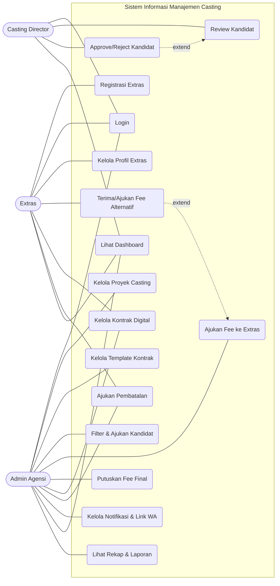
```mermaid
flowchart LR
    Admin([Admin Agensi])
    CD([Casting Director])
    Extras([Extras])

    subgraph SIS[" Sistem Informasi Manajemen Casting "]
        UC01(Registrasi Extras)
        UC02(Login)
        UC03(Kelola Profil Extras)
        UC04(Kelola Proyek Casting)
        UC05(Kelola Template Kontrak)
        UC06(Review Kandidat)
        UC07(Approve/Reject Kandidat)
        UC08(Filter & Ajukan Kandidat)
        UC09(Ajukan Fee ke Extras)
        UC10(Terima/Ajukan Fee Alternatif)
        UC11(Putuskan Fee Final)
        UC12(Kelola Kontrak Digital)
        UC13(Ajukan Pembatalan)
        UC14(Kelola Notifikasi & Link WA)
        UC15(Lihat Dashboard)
        UC16(Lihat Rekap & Laporan)
    end

    Extras --- UC01
    Admin --- UC02
    CD --- UC02
    Extras --- UC02
    Extras --- UC03
    Admin --- UC04
    Admin --- UC05
    CD --- UC06
    CD --- UC07
    UC07 -.extend.-> UC06
    Admin --- UC08
    Admin --- UC09
    Extras --- UC10
    UC10 -.extend.-> UC09
    Admin --- UC11
    Admin --- UC12
    Extras --- UC12
    Admin --- UC13
    Extras --- UC13
    Admin --- UC14
    Admin --- UC15
    CD --- UC15
    Extras --- UC15
    Admin --- UC16
```

---

# 12. UML Documentation

> Seluruh Activity Diagram dan Sequence Diagram di bawah ini disusun agar **1:1 memetakan ke 16 use case** pada §11.4 — tidak ada use case baru yang ditambahkan. Alur alternatif/pengecualian (verifikasi email, lockout, tutup paksa, konfirmasi transfer fee, reminder deadline) digambarkan sebagai **cabang alur di dalam use case induknya**, sesuai pemetaan §11.2.

## 12.1 Activity Diagram — Registrasi Extras (UC: Registrasi Extras) (Mermaid)

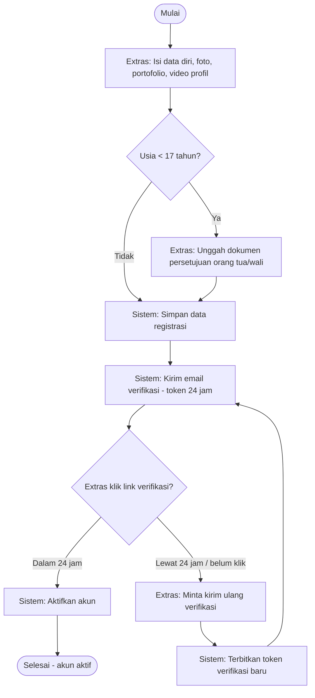
```mermaid
flowchart TD
    A([Mulai]) --> B[Extras: Isi data diri, foto, portofolio, video profil]
    B --> C{Usia < 17 tahun?}
    C -- Ya --> D[Extras: Unggah dokumen persetujuan orang tua/wali]
    C -- Tidak --> E[Sistem: Simpan data registrasi]
    D --> E
    E --> F[Sistem: Kirim email verifikasi - token 24 jam]
    F --> G{Extras klik link verifikasi?}
    G -- Dalam 24 jam --> H[Sistem: Aktifkan akun]
    H --> Z1([Selesai - akun aktif])
    G -- Lewat 24 jam / belum klik --> I[Extras: Minta kirim ulang verifikasi]
    I --> J[Sistem: Terbitkan token verifikasi baru]
    J --> F
```

## 12.2 Activity Diagram — Login (UC: Login) (Mermaid)

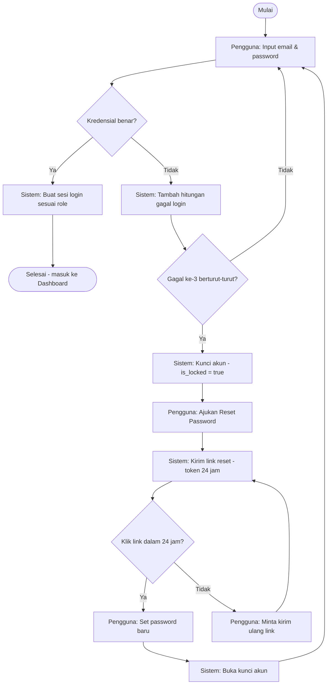
```mermaid
flowchart TD
    A([Mulai]) --> B[Pengguna: Input email & password]
    B --> C{Kredensial benar?}
    C -- Ya --> D[Sistem: Buat sesi login sesuai role]
    D --> Z1([Selesai - masuk ke Dashboard])
    C -- Tidak --> E[Sistem: Tambah hitungan gagal login]
    E --> F{Gagal ke-3 berturut-turut?}
    F -- Tidak --> B
    F -- Ya --> G[Sistem: Kunci akun - is_locked = true]
    G --> H[Pengguna: Ajukan Reset Password]
    H --> I[Sistem: Kirim link reset - token 24 jam]
    I --> J{Klik link dalam 24 jam?}
    J -- Ya --> K[Pengguna: Set password baru]
    K --> L[Sistem: Buka kunci akun]
    L --> B
    J -- Tidak --> M[Pengguna: Minta kirim ulang link]
    M --> I
```

## 12.3 Activity Diagram — Filter & Ajukan Kandidat ke CD, Review, Approve/Reject (UC: Filter & Ajukan Kandidat ke CD, Review Kandidat, Approve/Reject Kandidat) (Mermaid)

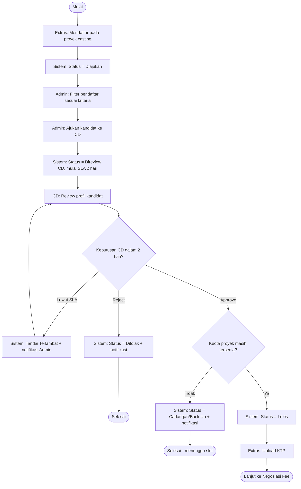
```mermaid
flowchart TD
    A([Mulai]) --> B[Extras: Mendaftar pada proyek casting]
    B --> C[Sistem: Status = Diajukan]
    C --> D[Admin: Filter pendaftar sesuai kriteria]
    D --> E[Admin: Ajukan kandidat ke CD]
    E --> F[Sistem: Status = Direview CD, mulai SLA 2 hari]
    F --> G[CD: Review profil kandidat]
    G --> H{Keputusan CD dalam 2 hari?}
    H -- Lewat SLA --> H1[Sistem: Tandai Terlambat + notifikasi Admin]
    H1 --> G
    H -- Reject --> I[Sistem: Status = Ditolak + notifikasi]
    I --> Z1([Selesai])
    H -- Approve --> J{Kuota proyek masih tersedia?}
    J -- Tidak --> K[Sistem: Status = Cadangan/Back Up + notifikasi]
    K --> Z2([Selesai - menunggu slot])
    J -- Ya --> L[Sistem: Status = Lolos]
    L --> M[Extras: Upload KTP]
    M --> N([Lanjut ke Negosiasi Fee])
```

## 12.4 Activity Diagram — Kelola Proyek Casting (UC: Kelola Proyek Casting) (Mermaid)

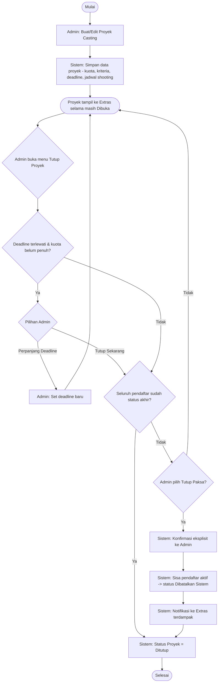
```mermaid
flowchart TD
    A([Mulai]) --> B[Admin: Buat/Edit Proyek Casting]
    B --> C[Sistem: Simpan data proyek - kuota, kriteria, deadline, jadwal shooting]
    C --> D([Proyek tampil ke Extras selama masih Dibuka])
    D --> E{Admin buka menu Tutup Proyek}
    E --> F{Deadline terlewati & kuota belum penuh?}
    F -- Ya --> G{Pilihan Admin}
    G -- Perpanjang Deadline --> H[Admin: Set deadline baru]
    H --> D
    G -- Tutup Sekarang --> I{Seluruh pendaftar sudah status akhir?}
    F -- Tidak --> I
    I -- Ya --> J[Sistem: Status Proyek = Ditutup]
    J --> Z1([Selesai])
    I -- Tidak --> K{Admin pilih Tutup Paksa?}
    K -- Tidak --> D
    K -- Ya --> L[Sistem: Konfirmasi eksplisit ke Admin]
    L --> M[Sistem: Sisa pendaftar aktif -> status Dibatalkan Sistem]
    M --> N[Sistem: Notifikasi ke Extras terdampak]
    N --> J
```

## 12.5 Activity Diagram — Negosiasi Fee Digital (UC: Ajukan Fee ke Extras, Terima/Ajukan Fee Alternatif, Putuskan Fee Final) (Mermaid)

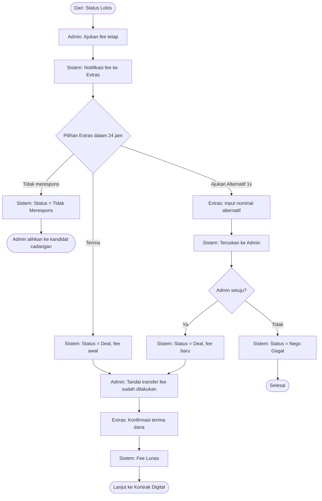
```mermaid
flowchart TD
    A([Dari: Status Lolos]) --> B[Admin: Ajukan fee tetap]
    B --> C[Sistem: Notifikasi fee ke Extras]
    C --> D{Pilihan Extras dalam 24 jam}
    D -- Tidak merespons --> E[Sistem: Status = Tidak Merespons]
    E --> F([Admin alihkan ke kandidat cadangan])
    D -- Terima --> G[Sistem: Status = Deal, fee awal]
    D -- Ajukan Alternatif 1x --> I[Extras: Input nominal alternatif]
    I --> J[Sistem: Teruskan ke Admin]
    J --> K{Admin setuju?}
    K -- Ya --> L[Sistem: Status = Deal, fee baru]
    K -- Tidak --> M[Sistem: Status = Nego Gagal]
    M --> Z1([Selesai])
    G --> N[Admin: Tandai transfer fee sudah dilakukan]
    L --> N
    N --> O[Extras: Konfirmasi terima dana]
    O --> P[Sistem: Fee Lunas]
    P --> Q([Lanjut ke Kontrak Digital])
```

## 12.6 Activity Diagram — Kelola Kontrak Digital (UC: Kelola Kontrak Digital) (Mermaid)

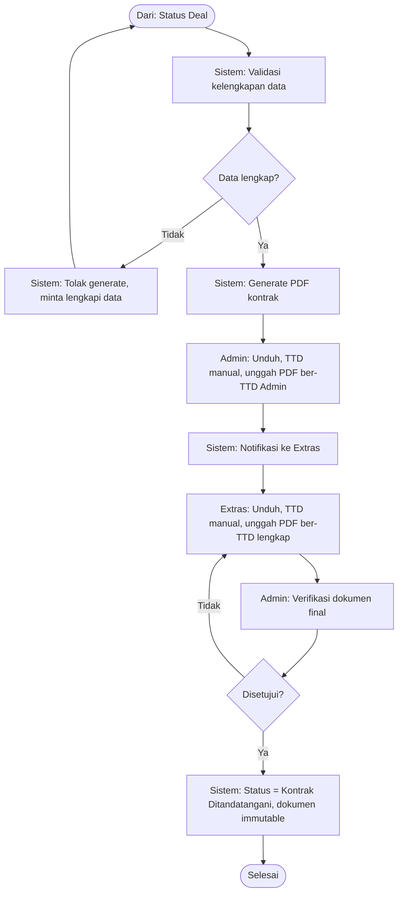
```mermaid
flowchart TD
    A([Dari: Status Deal]) --> B[Sistem: Validasi kelengkapan data]
    B --> C{Data lengkap?}
    C -- Tidak --> D[Sistem: Tolak generate, minta lengkapi data]
    D --> A
    C -- Ya --> E[Sistem: Generate PDF kontrak]
    E --> F[Admin: Unduh, TTD manual, unggah PDF ber-TTD Admin]
    F --> G[Sistem: Notifikasi ke Extras]
    G --> H[Extras: Unduh, TTD manual, unggah PDF ber-TTD lengkap]
    H --> I[Admin: Verifikasi dokumen final]
    I --> J{Disetujui?}
    J -- Tidak --> H
    J -- Ya --> K[Sistem: Status = Kontrak Ditandatangani, dokumen immutable]
    K --> L([Selesai])
```

## 12.7 Activity Diagram — Ajukan Pembatalan (UC: Ajukan Pembatalan) (Mermaid)

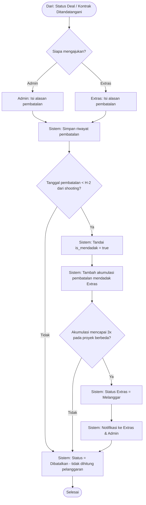
```mermaid
flowchart TD
    A([Dari: Status Deal / Kontrak Ditandatangani]) --> B{Siapa mengajukan?}
    B -- Admin --> C[Admin: Isi alasan pembatalan]
    B -- Extras --> D[Extras: Isi alasan pembatalan]
    C --> E[Sistem: Simpan riwayat pembatalan]
    D --> E
    E --> F{Tanggal pembatalan < H-2 dari shooting?}
    F -- Tidak --> G[Sistem: Status = Dibatalkan - tidak dihitung pelanggaran]
    G --> Z1([Selesai])
    F -- Ya --> H[Sistem: Tandai is_mendadak = true]
    H --> I[Sistem: Tambah akumulasi pembatalan mendadak Extras]
    I --> J{Akumulasi mencapai 3x pada proyek berbeda?}
    J -- Tidak --> G
    J -- Ya --> K[Sistem: Status Extras = Melanggar]
    K --> L[Sistem: Notifikasi ke Extras & Admin]
    L --> G
```

## 12.8 Activity Diagram — Kelola Notifikasi & Link Grup WA (UC: Kelola Notifikasi & Link Grup WA) (Mermaid)

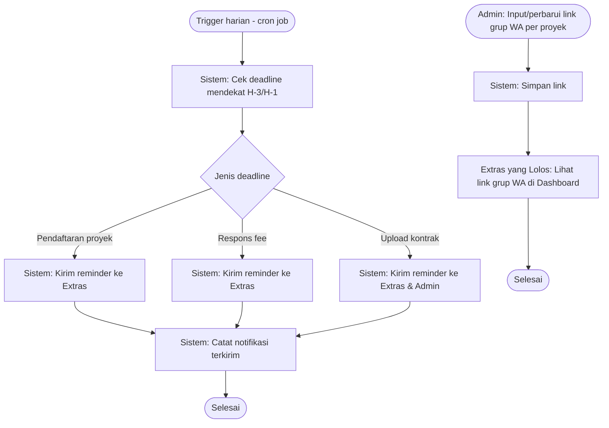
```mermaid
flowchart TD
    A([Trigger harian - cron job]) --> B[Sistem: Cek deadline mendekat H-3/H-1]
    B --> C{Jenis deadline}
    C -- Pendaftaran proyek --> D[Sistem: Kirim reminder ke Extras]
    C -- Respons fee --> E[Sistem: Kirim reminder ke Extras]
    C -- Upload kontrak --> F[Sistem: Kirim reminder ke Extras & Admin]
    D --> G[Sistem: Catat notifikasi terkirim]
    E --> G
    F --> G
    G --> Z1([Selesai])
    A2([Admin: Input/perbarui link grup WA per proyek]) --> B2[Sistem: Simpan link]
    B2 --> C2[Extras yang Lolos: Lihat link grup WA di Dashboard]
    C2 --> Z2([Selesai])
```

---

## 12.9 Sequence Diagram — Registrasi Extras (UC: Registrasi Extras) (Mermaid)

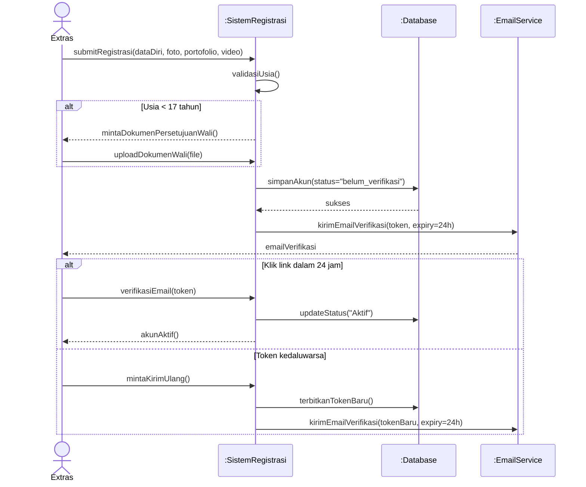
```mermaid
sequenceDiagram
    actor Extras
    participant Sistem as :SistemRegistrasi
    participant DB as :Database
    participant Mail as :EmailService

    Extras->>Sistem: submitRegistrasi(dataDiri, foto, portofolio, video)
    Sistem->>Sistem: validasiUsia()
    alt Usia < 17 tahun
        Sistem-->>Extras: mintaDokumenPersetujuanWali()
        Extras->>Sistem: uploadDokumenWali(file)
    end
    Sistem->>DB: simpanAkun(status="belum_verifikasi")
    DB-->>Sistem: sukses
    Sistem->>Mail: kirimEmailVerifikasi(token, expiry=24h)
    Mail-->>Extras: emailVerifikasi

    alt Klik link dalam 24 jam
        Extras->>Sistem: verifikasiEmail(token)
        Sistem->>DB: updateStatus("Aktif")
        Sistem-->>Extras: akunAktif()
    else Token kedaluwarsa
        Extras->>Sistem: mintaKirimUlang()
        Sistem->>DB: terbitkanTokenBaru()
        Sistem->>Mail: kirimEmailVerifikasi(tokenBaru, expiry=24h)
    end
```

## 12.10 Sequence Diagram — Login (UC: Login) (Mermaid)

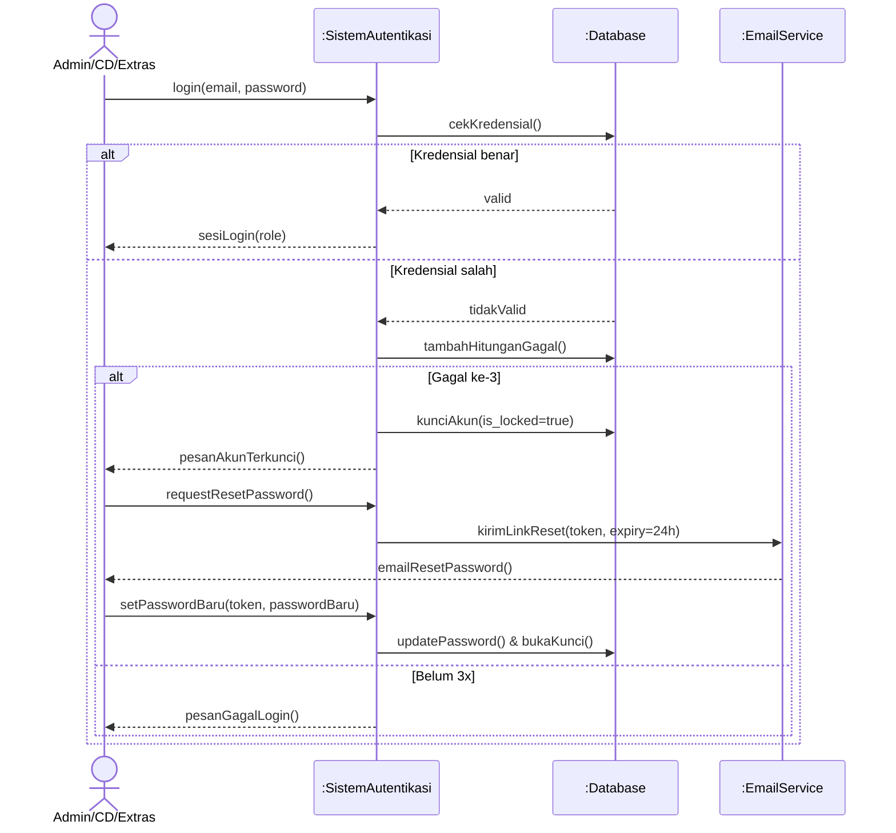
```mermaid
sequenceDiagram
    actor Pengguna as Admin/CD/Extras
    participant Sistem as :SistemAutentikasi
    participant DB as :Database
    participant Mail as :EmailService

    Pengguna->>Sistem: login(email, password)
    Sistem->>DB: cekKredensial()
    alt Kredensial benar
        DB-->>Sistem: valid
        Sistem-->>Pengguna: sesiLogin(role)
    else Kredensial salah
        DB-->>Sistem: tidakValid
        Sistem->>DB: tambahHitunganGagal()
        alt Gagal ke-3
            Sistem->>DB: kunciAkun(is_locked=true)
            Sistem-->>Pengguna: pesanAkunTerkunci()
            Pengguna->>Sistem: requestResetPassword()
            Sistem->>Mail: kirimLinkReset(token, expiry=24h)
            Mail-->>Pengguna: emailResetPassword()
            Pengguna->>Sistem: setPasswordBaru(token, passwordBaru)
            Sistem->>DB: updatePassword() & bukaKunci()
        else Belum 3x
            Sistem-->>Pengguna: pesanGagalLogin()
        end
    end
```

## 12.11 Sequence Diagram — Review & Approve/Reject Kandidat (UC: Filter & Ajukan Kandidat ke CD, Review Kandidat, Approve/Reject Kandidat) (Mermaid)

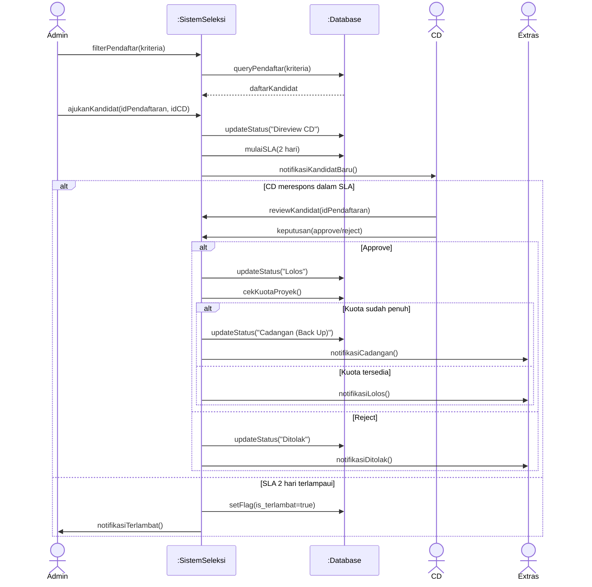
```mermaid
sequenceDiagram
    actor Admin
    participant Sistem as :SistemSeleksi
    participant DB as :Database
    actor CD
    actor Extras

    Admin->>Sistem: filterPendaftar(kriteria)
    Sistem->>DB: queryPendaftar(kriteria)
    DB-->>Sistem: daftarKandidat
    Admin->>Sistem: ajukanKandidat(idPendaftaran, idCD)
    Sistem->>DB: updateStatus("Direview CD")
    Sistem->>DB: mulaiSLA(2 hari)
    Sistem->>CD: notifikasiKandidatBaru()

    alt CD merespons dalam SLA
        CD->>Sistem: reviewKandidat(idPendaftaran)
        CD->>Sistem: keputusan(approve/reject)
        alt Approve
            Sistem->>DB: updateStatus("Lolos")
            Sistem->>DB: cekKuotaProyek()
            alt Kuota sudah penuh
                Sistem->>DB: updateStatus("Cadangan (Back Up)")
                Sistem->>Extras: notifikasiCadangan()
            else Kuota tersedia
                Sistem->>Extras: notifikasiLolos()
            end
        else Reject
            Sistem->>DB: updateStatus("Ditolak")
            Sistem->>Extras: notifikasiDitolak()
        end
    else SLA 2 hari terlampaui
        Sistem->>DB: setFlag(is_terlambat=true)
        Sistem->>Admin: notifikasiTerlambat()
    end
```

## 12.12 Sequence Diagram — Kelola Proyek Casting (UC: Kelola Proyek Casting) (Mermaid)

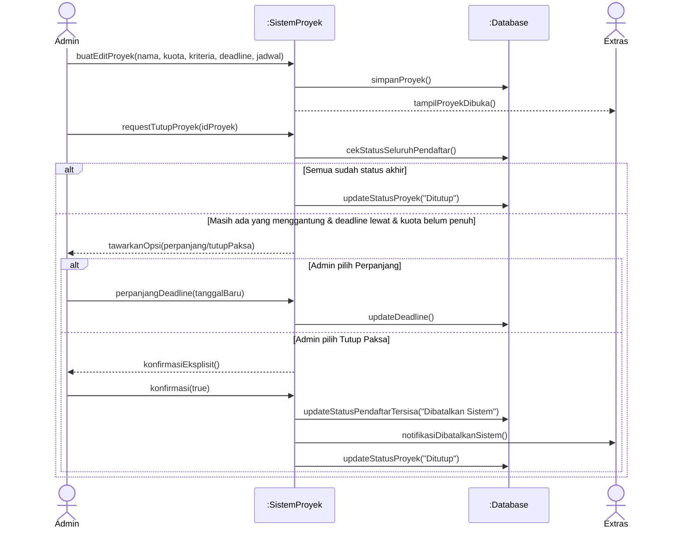
```mermaid
sequenceDiagram
    actor Admin
    participant Sistem as :SistemProyek
    participant DB as :Database
    actor Extras

    Admin->>Sistem: buatEditProyek(nama, kuota, kriteria, deadline, jadwal)
    Sistem->>DB: simpanProyek()
    Sistem-->>Extras: tampilProyekDibuka()

    Admin->>Sistem: requestTutupProyek(idProyek)
    Sistem->>DB: cekStatusSeluruhPendaftar()
    alt Semua sudah status akhir
        Sistem->>DB: updateStatusProyek("Ditutup")
    else Masih ada yang menggantung & deadline lewat & kuota belum penuh
        Sistem-->>Admin: tawarkanOpsi(perpanjang/tutupPaksa)
        alt Admin pilih Perpanjang
            Admin->>Sistem: perpanjangDeadline(tanggalBaru)
            Sistem->>DB: updateDeadline()
        else Admin pilih Tutup Paksa
            Sistem-->>Admin: konfirmasiEksplisit()
            Admin->>Sistem: konfirmasi(true)
            Sistem->>DB: updateStatusPendaftarTersisa("Dibatalkan Sistem")
            Sistem->>Extras: notifikasiDibatalkanSistem()
            Sistem->>DB: updateStatusProyek("Ditutup")
        end
    end
```

## 12.13 Sequence Diagram — Negosiasi Fee Digital (UC: Ajukan Fee ke Extras, Terima/Ajukan Fee Alternatif, Putuskan Fee Final) (Mermaid)

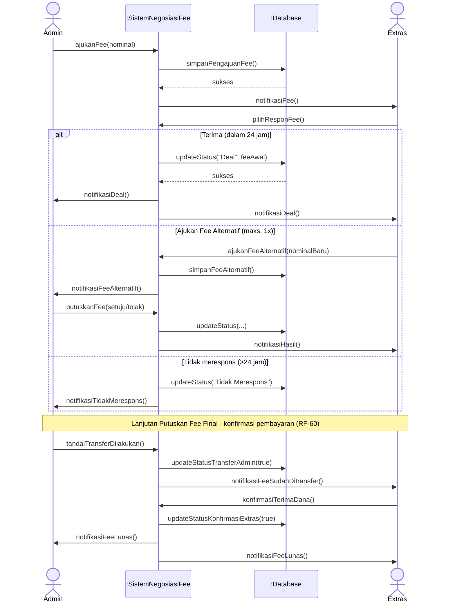
```mermaid
sequenceDiagram
    actor Admin
    participant Sistem as :SistemNegosiasiFee
    participant DB as :Database
    actor Extras

    Admin->>Sistem: ajukanFee(nominal)
    Sistem->>DB: simpanPengajuanFee()
    DB-->>Sistem: sukses
    Sistem->>Extras: notifikasiFee()
    Extras->>Sistem: pilihResponFee()

    alt Terima (dalam 24 jam)
        Sistem->>DB: updateStatus("Deal", feeAwal)
        DB-->>Sistem: sukses
        Sistem->>Admin: notifikasiDeal()
        Sistem->>Extras: notifikasiDeal()
    else Ajukan Fee Alternatif (maks. 1x)
        Extras->>Sistem: ajukanFeeAlternatif(nominalBaru)
        Sistem->>DB: simpanFeeAlternatif()
        Sistem->>Admin: notifikasiFeeAlternatif()
        Admin->>Sistem: putuskanFee(setuju/tolak)
        Sistem->>DB: updateStatus(...)
        Sistem->>Extras: notifikasiHasil()
    else Tidak merespons (>24 jam)
        Sistem->>DB: updateStatus("Tidak Merespons")
        Sistem->>Admin: notifikasiTidakMerespons()
    end

    Note over Admin,Extras: Lanjutan Putuskan Fee Final - konfirmasi pembayaran (RF-60)
    Admin->>Sistem: tandaiTransferDilakukan()
    Sistem->>DB: updateStatusTransferAdmin(true)
    Sistem->>Extras: notifikasiFeeSudahDitransfer()
    Extras->>Sistem: konfirmasiTerimaDana()
    Sistem->>DB: updateStatusKonfirmasiExtras(true)
    Sistem->>Admin: notifikasiFeeLunas()
    Sistem->>Extras: notifikasiFeeLunas()
```

## 12.14 Sequence Diagram — Kelola Kontrak Digital (UC: Kelola Kontrak Digital) (Mermaid)

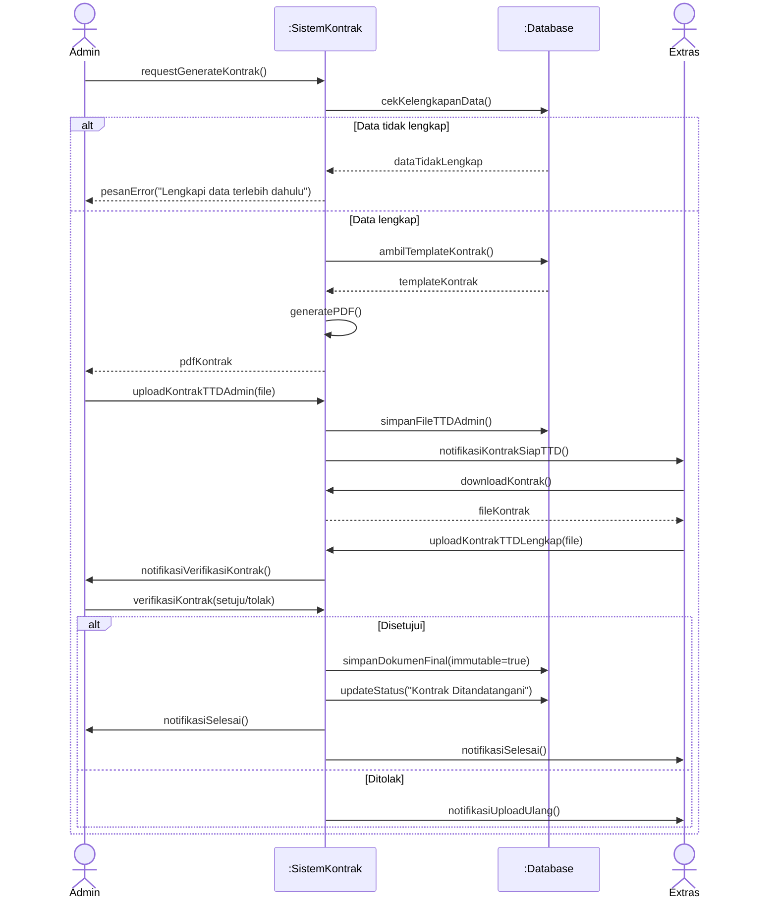
```mermaid
sequenceDiagram
    actor Admin
    participant Sistem as :SistemKontrak
    participant DB as :Database
    actor Extras

    Admin->>Sistem: requestGenerateKontrak()
    Sistem->>DB: cekKelengkapanData()
    alt Data tidak lengkap
        DB-->>Sistem: dataTidakLengkap
        Sistem-->>Admin: pesanError("Lengkapi data terlebih dahulu")
    else Data lengkap
        Sistem->>DB: ambilTemplateKontrak()
        DB-->>Sistem: templateKontrak
        Sistem->>Sistem: generatePDF()
        Sistem-->>Admin: pdfKontrak
        Admin->>Sistem: uploadKontrakTTDAdmin(file)
        Sistem->>DB: simpanFileTTDAdmin()
        Sistem->>Extras: notifikasiKontrakSiapTTD()
        Extras->>Sistem: downloadKontrak()
        Sistem-->>Extras: fileKontrak
        Extras->>Sistem: uploadKontrakTTDLengkap(file)
        Sistem->>Admin: notifikasiVerifikasiKontrak()
        Admin->>Sistem: verifikasiKontrak(setuju/tolak)
        alt Disetujui
            Sistem->>DB: simpanDokumenFinal(immutable=true)
            Sistem->>DB: updateStatus("Kontrak Ditandatangani")
            Sistem->>Admin: notifikasiSelesai()
            Sistem->>Extras: notifikasiSelesai()
        else Ditolak
            Sistem->>Extras: notifikasiUploadUlang()
        end
    end
```

## 12.15 Sequence Diagram — Ajukan Pembatalan (UC: Ajukan Pembatalan) (Mermaid)

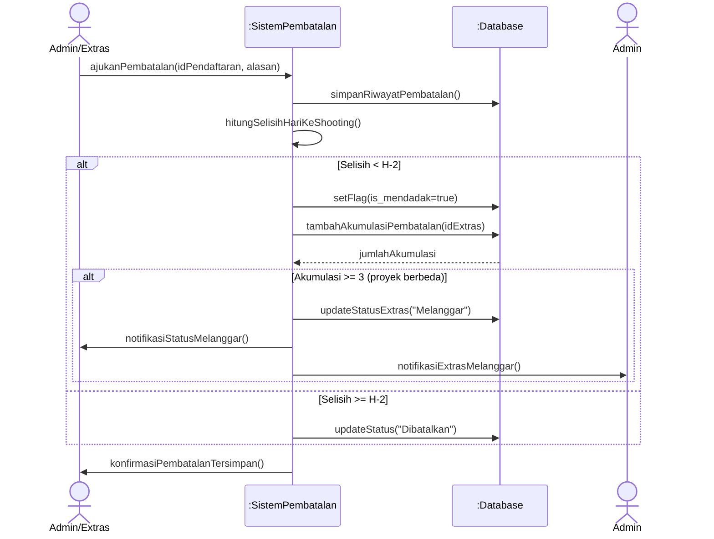
```mermaid
sequenceDiagram
    actor Pemohon as Admin/Extras
    participant Sistem as :SistemPembatalan
    participant DB as :Database
    actor AdminNotif as Admin

    Pemohon->>Sistem: ajukanPembatalan(idPendaftaran, alasan)
    Sistem->>DB: simpanRiwayatPembatalan()
    Sistem->>Sistem: hitungSelisihHariKeShooting()
    alt Selisih < H-2
        Sistem->>DB: setFlag(is_mendadak=true)
        Sistem->>DB: tambahAkumulasiPembatalan(idExtras)
        DB-->>Sistem: jumlahAkumulasi
        alt Akumulasi >= 3 (proyek berbeda)
            Sistem->>DB: updateStatusExtras("Melanggar")
            Sistem->>Pemohon: notifikasiStatusMelanggar()
            Sistem->>AdminNotif: notifikasiExtrasMelanggar()
        end
    else Selisih >= H-2
        Sistem->>DB: updateStatus("Dibatalkan")
    end
    Sistem->>Pemohon: konfirmasiPembatalanTersimpan()
```

## 12.16 Sequence Diagram — Kelola Notifikasi & Link Grup WA (UC: Kelola Notifikasi & Link Grup WA) (Mermaid)

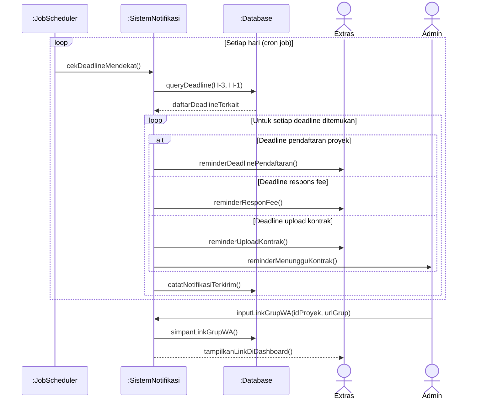
```mermaid
sequenceDiagram
    participant Scheduler as :JobScheduler
    participant Sistem as :SistemNotifikasi
    participant DB as :Database
    actor Extras
    actor Admin

    loop Setiap hari (cron job)
        Scheduler->>Sistem: cekDeadlineMendekat()
        Sistem->>DB: queryDeadline(H-3, H-1)
        DB-->>Sistem: daftarDeadlineTerkait
        loop Untuk setiap deadline ditemukan
            alt Deadline pendaftaran proyek
                Sistem->>Extras: reminderDeadlinePendaftaran()
            else Deadline respons fee
                Sistem->>Extras: reminderResponFee()
            else Deadline upload kontrak
                Sistem->>Extras: reminderUploadKontrak()
                Sistem->>Admin: reminderMenungguKontrak()
            end
            Sistem->>DB: catatNotifikasiTerkirim()
        end
    end

    Admin->>Sistem: inputLinkGrupWA(idProyek, urlGrup)
    Sistem->>DB: simpanLinkGrupWA()
    Sistem-->>Extras: tampilkanLinkDiDashboard()
```

## 12.17 Class Diagram (Mermaid)

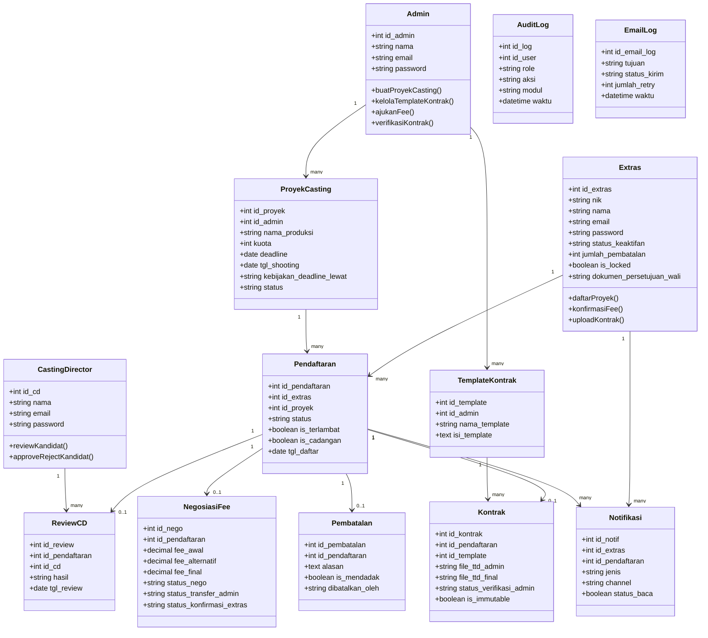
```mermaid
classDiagram
    class Admin {
      +int id_admin
      +string nama
      +string email
      +string password
      +buatProyekCasting()
      +kelolaTemplateKontrak()
      +ajukanFee()
      +verifikasiKontrak()
    }
    class CastingDirector {
      +int id_cd
      +string nama
      +string email
      +string password
      +reviewKandidat()
      +approveRejectKandidat()
    }
    class Extras {
      +int id_extras
      +string nik
      +string nama
      +string email
      +string password
      +string status_keaktifan
      +int jumlah_pembatalan
      +boolean is_locked
      +string dokumen_persetujuan_wali
      +daftarProyek()
      +konfirmasiFee()
      +uploadKontrak()
    }
    class ProyekCasting {
      +int id_proyek
      +int id_admin
      +string nama_produksi
      +int kuota
      +date deadline
      +date tgl_shooting
      +string kebijakan_deadline_lewat
      +string status
    }
    class Pendaftaran {
      +int id_pendaftaran
      +int id_extras
      +int id_proyek
      +string status
      +boolean is_terlambat
      +boolean is_cadangan
      +date tgl_daftar
    }
    class ReviewCD {
      +int id_review
      +int id_pendaftaran
      +int id_cd
      +string hasil
      +date tgl_review
    }
    class NegosiasiFee {
      +int id_nego
      +int id_pendaftaran
      +decimal fee_awal
      +decimal fee_alternatif
      +decimal fee_final
      +string status_nego
      +string status_transfer_admin
      +string status_konfirmasi_extras
    }
    class TemplateKontrak {
      +int id_template
      +int id_admin
      +string nama_template
      +text isi_template
    }
    class Kontrak {
      +int id_kontrak
      +int id_pendaftaran
      +int id_template
      +string file_ttd_admin
      +string file_ttd_final
      +string status_verifikasi_admin
      +boolean is_immutable
    }
    class Pembatalan {
      +int id_pembatalan
      +int id_pendaftaran
      +text alasan
      +boolean is_mendadak
      +string dibatalkan_oleh
    }
    class Notifikasi {
      +int id_notif
      +int id_extras
      +int id_pendaftaran
      +string jenis
      +string channel
      +boolean status_baca
    }
    class AuditLog {
      +int id_log
      +int id_user
      +string role
      +string aksi
      +string modul
      +datetime waktu
    }
    class EmailLog {
      +int id_email_log
      +string tujuan
      +string status_kirim
      +int jumlah_retry
      +datetime waktu
    }

    Admin "1" --> "many" ProyekCasting
    Admin "1" --> "many" TemplateKontrak
    Extras "1" --> "many" Pendaftaran
    ProyekCasting "1" --> "many" Pendaftaran
    Pendaftaran "1" --> "0..1" ReviewCD
    CastingDirector "1" --> "many" ReviewCD
    Pendaftaran "1" --> "0..1" NegosiasiFee
    Pendaftaran "1" --> "0..1" Kontrak
    TemplateKontrak "1" --> "many" Kontrak
    Pendaftaran "1" --> "0..1" Pembatalan
    Extras "1" --> "many" Notifikasi
    Pendaftaran "1" --> "many" Notifikasi
```

---


# 13. Data Model

| Entitas | Deskripsi |
|---|---|
| Admin | Akun Admin Agensi |
| CastingDirector | Akun CD |
| Extras | Akun & profil extras |
| ProyekCasting | Data proyek casting |
| Pendaftaran | Entitas transaksi utama (hub) |
| ReviewCD | Hasil review CD |
| NegosiasiFee | Riwayat negosiasi fee |
| TemplateKontrak | Template kontrak dinamis |
| Kontrak | Dokumen kontrak final |
| Pembatalan | Riwayat pembatalan |
| Notifikasi | Log notifikasi |
| AuditLog *(baru)* | Jejak audit modul sensitif |
| EmailLog *(baru)* | Log status pengiriman email |

---

# 14. ERD (Mermaid)

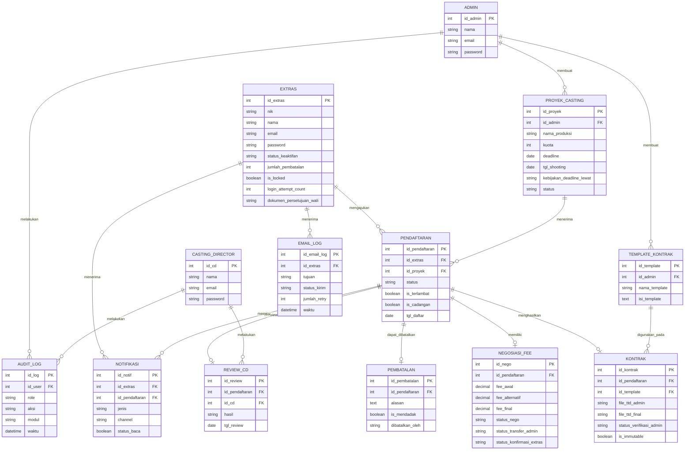
```mermaid
erDiagram
  ADMIN ||--o{ PROYEK_CASTING : membuat
  ADMIN ||--o{ TEMPLATE_KONTRAK : membuat
  ADMIN ||--o{ AUDIT_LOG : melakukan
  CASTING_DIRECTOR ||--o{ AUDIT_LOG : melakukan
  EXTRAS ||--o{ PENDAFTARAN : mengajukan
  EXTRAS ||--o{ NOTIFIKASI : menerima
  EXTRAS ||--o{ EMAIL_LOG : menerima
  PROYEK_CASTING ||--o{ PENDAFTARAN : menerima
  PENDAFTARAN ||--o| REVIEW_CD : direview
  CASTING_DIRECTOR ||--o{ REVIEW_CD : melakukan
  PENDAFTARAN ||--o| NEGOSIASI_FEE : memiliki
  PENDAFTARAN ||--o| KONTRAK : menghasilkan
  TEMPLATE_KONTRAK ||--o{ KONTRAK : digunakan_pada
  PENDAFTARAN ||--o| PEMBATALAN : dapat_dibatalkan
  PENDAFTARAN ||--o{ NOTIFIKASI : memicu

  ADMIN {
    int id_admin PK
    string nama
    string email
    string password
  }
  CASTING_DIRECTOR {
    int id_cd PK
    string nama
    string email
    string password
  }
  EXTRAS {
    int id_extras PK
    string nik
    string nama
    string email
    string password
    string status_keaktifan
    int jumlah_pembatalan
    boolean is_locked
    int login_attempt_count
    string dokumen_persetujuan_wali
  }
  PROYEK_CASTING {
    int id_proyek PK
    int id_admin FK
    string nama_produksi
    int kuota
    date deadline
    date tgl_shooting
    string kebijakan_deadline_lewat
    string status
  }
  PENDAFTARAN {
    int id_pendaftaran PK
    int id_extras FK
    int id_proyek FK
    string status
    boolean is_terlambat
    boolean is_cadangan
    date tgl_daftar
  }
  REVIEW_CD {
    int id_review PK
    int id_pendaftaran FK
    int id_cd FK
    string hasil
    date tgl_review
  }
  NEGOSIASI_FEE {
    int id_nego PK
    int id_pendaftaran FK
    decimal fee_awal
    decimal fee_alternatif
    decimal fee_final
    string status_nego
    string status_transfer_admin
    string status_konfirmasi_extras
  }
  TEMPLATE_KONTRAK {
    int id_template PK
    int id_admin FK
    string nama_template
    text isi_template
  }
  KONTRAK {
    int id_kontrak PK
    int id_pendaftaran FK
    int id_template FK
    string file_ttd_admin
    string file_ttd_final
    string status_verifikasi_admin
    boolean is_immutable
  }
  PEMBATALAN {
    int id_pembatalan PK
    int id_pendaftaran FK
    text alasan
    boolean is_mendadak
    string dibatalkan_oleh
  }
  NOTIFIKASI {
    int id_notif PK
    int id_extras FK
    int id_pendaftaran FK
    string jenis
    string channel
    boolean status_baca
  }
  AUDIT_LOG {
    int id_log PK
    int id_user FK
    string role
    string aksi
    string modul
    datetime waktu
  }
  EMAIL_LOG {
    int id_email_log PK
    int id_extras FK
    string tujuan
    string status_kirim
    int jumlah_retry
    datetime waktu
  }
```

---

# 15. Transformation ERD to LRS & LRS

## 15.1 Konsep Transformasi

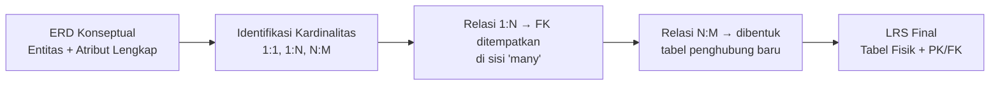
```mermaid
flowchart LR
    A[ERD Konseptual<br/>Entitas + Atribut Lengkap] --> B[Identifikasi Kardinalitas<br/>1:1, 1:N, N:M]
    B --> C[Relasi 1:N → FK ditempatkan<br/>di sisi 'many']
    C --> D[Relasi N:M → dibentuk<br/>tabel penghubung baru]
    D --> E[LRS Final<br/>Tabel Fisik + PK/FK]
```

**Penjelasan:** Seluruh relasi pada ERD SIM Casting JBTB bersifat **1:1** atau **1:N** (tidak ada relasi N:M langsung, karena relasi many-to-many antara Extras dan ProyekCasting sudah diresolusi melalui entitas **Pendaftaran** sebagai tabel penghubung sejak tahap ERD). Sehingga transformasi ke LRS hanya perlu menempatkan **Foreign Key (FK) pada entitas di sisi "many"**, tanpa perlu membentuk tabel penghubung tambahan.

| Relasi ERD | Kardinalitas | Penempatan FK pada LRS |
|---|---|---|
| Admin – ProyekCasting | 1:N | `id_admin` di tabel `proyek_casting` |
| Admin – TemplateKontrak | 1:N | `id_admin` di tabel `template_kontrak` |
| Extras – Pendaftaran | 1:N | `id_extras` di tabel `pendaftaran` |
| ProyekCasting – Pendaftaran | 1:N | `id_proyek` di tabel `pendaftaran` |
| Pendaftaran – ReviewCD | 1:0..1 | `id_pendaftaran` di tabel `review_cd` |
| CastingDirector – ReviewCD | 1:N | `id_cd` di tabel `review_cd` |
| Pendaftaran – NegosiasiFee | 1:0..1 | `id_pendaftaran` di tabel `negosiasi_fee` |
| Pendaftaran – Kontrak | 1:0..1 | `id_pendaftaran` di tabel `kontrak` |
| TemplateKontrak – Kontrak | 1:N | `id_template` di tabel `kontrak` |
| Pendaftaran – Pembatalan | 1:0..1 | `id_pendaftaran` di tabel `pembatalan` |
| Extras – Notifikasi | 1:N | `id_extras` di tabel `notifikasi` |
| Pendaftaran – Notifikasi | 1:N | `id_pendaftaran` di tabel `notifikasi` |
| Admin/CD – AuditLog | 1:N | `id_user` + `role` di tabel `audit_log` |
| Extras – EmailLog | 1:N | `id_extras` di tabel `email_log` |

## 15.2 LRS (Mermaid)

```mermaid
erDiagram
  ADMIN ||--o{ PROYEK_CASTING : ""
  ADMIN ||--o{ TEMPLATE_KONTRAK : ""
  EXTRAS ||--o{ PENDAFTARAN : ""
  PROYEK_CASTING ||--o{ PENDAFTARAN : ""
  CASTING_DIRECTOR ||--o{ REVIEW_CD : ""
  PENDAFTARAN ||--o| REVIEW_CD : ""
  PENDAFTARAN ||--o| NEGOSIASI_FEE : ""
  PENDAFTARAN ||--o| KONTRAK : ""
  TEMPLATE_KONTRAK ||--o{ KONTRAK : ""
  PENDAFTARAN ||--o| PEMBATALAN : ""
  EXTRAS ||--o{ NOTIFIKASI : ""
  PENDAFTARAN ||--o{ NOTIFIKASI : ""

  ADMIN {
    int id_admin PK
  }
  CASTING_DIRECTOR {
    int id_cd PK
  }
  EXTRAS {
    int id_extras PK
  }
  PROYEK_CASTING {
    int id_proyek PK
    int id_admin FK
  }
  PENDAFTARAN {
    int id_pendaftaran PK
    int id_extras FK
    int id_proyek FK
  }
  REVIEW_CD {
    int id_review PK
    int id_pendaftaran FK
    int id_cd FK
  }
  NEGOSIASI_FEE {
    int id_nego PK
    int id_pendaftaran FK
  }
  TEMPLATE_KONTRAK {
    int id_template PK
    int id_admin FK
  }
  KONTRAK {
    int id_kontrak PK
    int id_pendaftaran FK
    int id_template FK
  }
  PEMBATALAN {
    int id_pembatalan PK
    int id_pendaftaran FK
  }
  NOTIFIKASI {
    int id_notif PK
    int id_extras FK
    int id_pendaftaran FK
  }
```

*(Entitas `AUDIT_LOG` dan `EMAIL_LOG` mengikuti pola FK yang sama — `id_user`/`id_extras` sebagai FK — dan disederhanakan dari diagram LRS di atas agar tetap terbaca; struktur lengkap tersedia pada bagian ERD §14 dan Database Schema §16.)*

---

# 16. Database Schema

| Tabel | Kolom Kunci | Tipe Data Penting |
|---|---|---|
| `admin` | id_admin (PK) | nama VARCHAR, email VARCHAR UNIQUE, password VARCHAR (hashed) |
| `casting_director` | id_cd (PK) | nama VARCHAR, email VARCHAR UNIQUE, password VARCHAR (hashed) |
| `extras` | id_extras (PK) | nik VARCHAR UNIQUE, email VARCHAR UNIQUE, password VARCHAR (hashed), status_keaktifan ENUM('Aktif','Tidak Aktif','Melanggar'), jumlah_pembatalan INT, is_locked BOOLEAN, login_attempt_count INT, email_verified_at TIMESTAMP NULL |
| `proyek_casting` | id_proyek (PK), id_admin (FK) | nama_produksi VARCHAR, kuota INT, deadline DATE, tgl_shooting DATE, lokasi_shooting VARCHAR, link_grup_wa VARCHAR, status ENUM('Terbuka','Ditutup','Ditutup Paksa'), kebijakan_deadline_lewat ENUM('Tutup','Perpanjang','Otomatis') |
| `pendaftaran` | id_pendaftaran (PK), id_extras (FK), id_proyek (FK) | status ENUM(...state machine...), is_terlambat BOOLEAN, is_cadangan BOOLEAN, tgl_daftar TIMESTAMP |
| `review_cd` | id_review (PK), id_pendaftaran (FK), id_cd (FK) | hasil ENUM('Lolos','Ditolak'), tgl_review TIMESTAMP, catatan TEXT |
| `negosiasi_fee` | id_nego (PK), id_pendaftaran (FK) | fee_awal DECIMAL, fee_alternatif DECIMAL NULL, fee_final DECIMAL, status_nego ENUM(...), status_transfer_admin BOOLEAN, status_konfirmasi_extras BOOLEAN |
| `template_kontrak` | id_template (PK), id_admin (FK) | nama_template VARCHAR, isi_template TEXT |
| `kontrak` | id_kontrak (PK), id_pendaftaran (FK), id_template (FK) | file_ttd_admin VARCHAR (Google Drive file ID), file_ttd_final VARCHAR, status_verifikasi_admin ENUM('Pending','Disetujui','Ditolak'), is_immutable BOOLEAN |
| `pembatalan` | id_pembatalan (PK), id_pendaftaran (FK) | alasan TEXT, is_mendadak BOOLEAN, dibatalkan_oleh ENUM('Admin','Extras'), tanggal TIMESTAMP |
| `notifikasi` | id_notif (PK), id_extras (FK), id_pendaftaran (FK, nullable) | jenis VARCHAR, channel ENUM('email','web_push'), pesan TEXT, status_baca BOOLEAN |
| `audit_log` | id_log (PK), id_user (FK, polymorphic), role ENUM('Admin','CD') | aksi VARCHAR, modul ENUM('Fee','Kontrak','Akun'), waktu TIMESTAMP |
| `email_log` | id_email_log (PK), id_extras (FK) | tujuan VARCHAR, status_kirim ENUM('Sukses','Gagal'), jumlah_retry INT, waktu TIMESTAMP |

---

# 17. Data Dictionary

| Field | Tabel | Tipe | Keterangan |
|---|---|---|---|
| id_extras | extras | INT (PK) | Identitas unik Extras |
| nik | extras | VARCHAR(16) UNIQUE | Nomor Induk Kependudukan, wajib unik |
| status_keaktifan | extras | ENUM | Aktif / Tidak Aktif / Melanggar |
| jumlah_pembatalan | extras | INT | Akumulasi pembatalan mendadak |
| is_locked | extras | BOOLEAN | Terkunci setelah 3x gagal login |
| dokumen_persetujuan_wali | extras | VARCHAR (nullable) | Wajib diisi bila usia < 17 tahun |
| kuota | proyek_casting | INT | Jumlah maksimum extras yang dibutuhkan |
| status | pendaftaran | ENUM | Diajukan/Direview CD/Lolos/Ditolak/Nego Fee/Deal/Cadangan/Kontrak Ditandatangani/Selesai/Dibatalkan |
| is_terlambat | pendaftaran | BOOLEAN | True jika review CD > 2 hari |
| is_cadangan | pendaftaran | BOOLEAN | True jika melebihi kuota proyek |
| fee_final | negosiasi_fee | DECIMAL | Nominal fee yang disepakati akhir |
| status_transfer_admin | negosiasi_fee | BOOLEAN | Ditandai Admin setelah transfer bank |
| status_konfirmasi_extras | negosiasi_fee | BOOLEAN | Dikonfirmasi Extras setelah menerima dana |
| is_immutable | kontrak | BOOLEAN | True setelah status Kontrak Ditandatangani |
| status_verifikasi_admin | kontrak | ENUM | Pending/Disetujui/Ditolak |
| is_mendadak | pembatalan | BOOLEAN | True jika pembatalan < H-2 dari shooting |
| channel | notifikasi | ENUM | email / web_push |
| modul | audit_log | ENUM | Fee / Kontrak / Akun |
| jumlah_retry | email_log | INT | Maks. 3x percobaan kirim ulang |

*(Data dictionary di atas mencakup field-field kunci yang membedakan sistem ini; field standar seperti `created_at`/`updated_at` mengikuti konvensi Laravel dan tidak dirinci satu per satu.)*

---

# 18. Notification Matrix

| Trigger | Penerima | Kanal | RF Terkait |
|---|---|---|---|
| Registrasi berhasil (verifikasi email) | Extras | Email | RF-36 |
| Kandidat baru diajukan ke CD | CD | Email/Web Push | RF-64 |
| Hasil seleksi (Lolos/Ditolak) | Extras | Email/Web Push | RF-28 |
| Permintaan konfirmasi fee | Extras | Email/Web Push | RF-28 |
| Kontrak siap ditandatangani | Extras | Email/Web Push | RF-28 |
| Kontrak selesai (Admin & Extras) | Admin, Extras | Email/Web Push | — |
| Status "Tidak Merespons" | Admin | Email/Web Push | RF-65 |
| Status "Terlambat" (SLA CD) | Admin | Email/Web Push | RF-65 |
| Status "Cadangan (Back Up)" | Extras | Email/Web Push | RF-66 |
| Pengingat H-3 & H-1 deadline | Extras/Admin (sesuai konteks) | Email/Web Push | RF-48 |
| Reset password / kirim ulang verifikasi | Aktor terkait | Email | RF-37, RF-51 |
| Info lanjutan proyek | Extras (yang lolos) | Link Grup WhatsApp (manual) | RF-29 |

---

# 19. Security Requirements

| Aspek | Ketentuan | Kode |
|---|---|---|
| Autentikasi | Email & password, tanpa MFA | RNF-10 |
| Kompleksitas password | Min. 8 karakter + kapital + angka + simbol | RF-57 |
| Proteksi brute-force | Kunci akun setelah 3x gagal login | RF-58 |
| Verifikasi akun | Wajib verifikasi email, dapat dikirim ulang (token 24 jam) | RF-36, RF-51 |
| Anti-bot | CAPTCHA pada form publik | RF-38 |
| Kontrol akses | RBAC 3 aktor + permission field-level (KTP/NIK hanya Admin) | RNF-02, RF-49 |
| Enkripsi | Data sensitif (KTP, foto, video) | RNF-01 |
| Password storage | Hash, bukan plain text | RNF-03 |
| Transport security | HTTPS/TLS wajib di seluruh trafik | RNF-14 |
| Integritas dokumen | Kontrak final immutable setelah verifikasi Admin | RF-50, RF-61 |
| Validasi file upload | Whitelist tipe & ukuran file | RF-44 |
| Audit trail | Log aksi pada modul Fee, Kontrak, Akun; hanya Admin yang dapat mengakses | RF-45, RF-59 |

---

# 20. Audit Log Requirements

| Item | Ketentuan |
|---|---|
| Modul yang diaudit | Negosiasi Fee, Kontrak Digital, Manajemen Akun |
| Data yang dicatat | Identitas pelaku (id_user, role), jenis aksi, modul terkait, timestamp |
| Retensi log | Mengikuti kebijakan retensi data umum (1 tahun) |
| Akses log | Hanya Admin Agensi |
| Contoh aksi yang tercatat | "Admin memutuskan fee alternatif", "Admin memverifikasi kontrak", "Admin menonaktifkan akun Extras" |

---

# 21. Reporting Requirements

| Laporan | Isi | Akses | Output |
|---|---|---|---|
| Rekap Extras Paling Sering Terpilih | Ranking keterpilihan per periode | Admin | Excel |
| Rekap Status Keaktifan Extras | Status Aktif/Tidak Aktif/Melanggar | Admin | Excel |
| Laporan Funnel per Proyek | Jumlah pendaftar tiap tahap status | Admin | Dashboard + Excel |
| Laporan Rekap Fee | Total nominal fee per proyek/periode | Admin | Excel |

---

# 22. Acceptance Criteria

Contoh kriteria penerimaan (format *Given-When-Then*) untuk fitur-fitur kunci:

**Negosiasi Fee**
- *Given* kandidat berstatus "Lolos" dan Admin mengajukan fee, *when* Extras tidak merespons dalam 24 jam, *then* status otomatis berubah menjadi "Tidak Merespons" dan Admin menerima notifikasi.

**Kontrak Digital**
- *Given* Extras telah mengunggah PDF ber-TTD lengkap, *when* Admin belum melakukan verifikasi, *then* status tetap "Menunggu Verifikasi" dan dokumen belum berstatus immutable.

**Manajemen Kuota**
- *Given* kuota proyek sudah tercapai oleh pendaftar lain yang "Deal", *when* pendaftar baru mencapai status "Lolos", *then* sistem menandai pendaftar tersebut sebagai "Cadangan (Back Up)".

**Keamanan Login**
- *Given* pengguna memasukkan password salah 3 kali berturut-turut, *when* percobaan ke-3 gagal, *then* akun terkunci dan pengguna diarahkan ke mekanisme reset password.

*(Kriteria penerimaan lengkap per RF dapat dikembangkan lebih lanjut pada dokumen Rancangan Pengujian Black Box.)*

---

# 23. Risk Analysis

| Risiko | Kemungkinan | Dampak | Mitigasi |
|---|---|---|---|
| Extras tidak merespons tawaran fee tepat waktu | Sedang | Sedang | SLA 24 jam + alih ke kandidat cadangan otomatis (RF-40) |
| CD lambat mereview kandidat | Sedang | Tinggi | SLA 2 hari + indikator "Terlambat" di dashboard (RF-41) |
| Kesalahan input data oleh Extras (usia, KTP) | Rendah | Sedang | Validasi field, verifikasi KTP saat lolos (RF-03, RF-54) |
| Kegagalan pengiriman email (SMTP Gmail rate limit) | Sedang | Sedang | Retry otomatis terbatas + log kegagalan (RF-52) |
| Ketergantungan pada Google Drive API | Rendah | Tinggi | Backup terpisah tambahan (RNF-18); pantau kuota/API Google Drive |
| Race condition saat aksi kritis bersamaan | Rendah | Tinggi | Validasi status terkini sebelum eksekusi aksi (RF-70) |
| Kebocoran data sensitif (KTP, foto) | Rendah | Tinggi | Enkripsi data, HTTPS/TLS, RBAC, field-level permission (RNF-01, RNF-14, RF-49) |
| Dokumen kontrak diedit/dihapus setelah selesai | Rendah | Tinggi | Immutability kontrak final (RF-50) |

---

# 24. Assumptions & Constraints

**Assumptions:**
- Jumlah pengguna tetap pada skala kecil (±70 extras, ±3 proyek/bulan) selama masa penelitian.
- JBTB Casting menyediakan akses SMTP Gmail dan akun Google Drive untuk keperluan sistem.
- Admin bersedia melakukan verifikasi manual pada tahap kontrak dan konfirmasi fee.

**Constraints:** *(lihat juga §3.2 Out-of-Scope)*
- Tidak ada anggaran untuk payment gateway atau e-signature tersertifikasi.
- Tidak ada integrasi API WhatsApp berbayar.
- Pengembangan menggunakan Laravel + MySQL sesuai keputusan awal, tanpa mempertimbangkan alternatif stack lain.

---

# 25. Future Enhancements

1. Integrasi payment gateway untuk pencatatan/pemrosesan fee otomatis.
2. Tanda tangan elektronik tersertifikasi (PSrE) menggantikan unggah dokumen scan.
3. Fitur rating/review performa extras pasca-produksi.
4. Modul penjadwalan produksi penuh (call sheet, shift kru).
5. Integrasi API WhatsApp Business untuk notifikasi otomatis (menggantikan link grup manual).
6. Laporan performa kecepatan review per CD (ditunda pada versi ini).
7. Aplikasi mobile native (Android/iOS) sebagai pelengkap versi web responsif.
8. Perluasan cakupan ke talent profesional (non-extras).

---

## Penutup

Dokumen SRS ini adalah konsolidasi final dari seluruh proses analisis kebutuhan (baseline awal, 3 addendum gap closure, dan diagram UML) dan **siap digunakan sebagai rujukan Bab III/IV skripsi** serta dasar perancangan **Class Diagram fisik**, **Rancangan Pengujian Black Box**, dan tahap implementasi selanjutnya.
