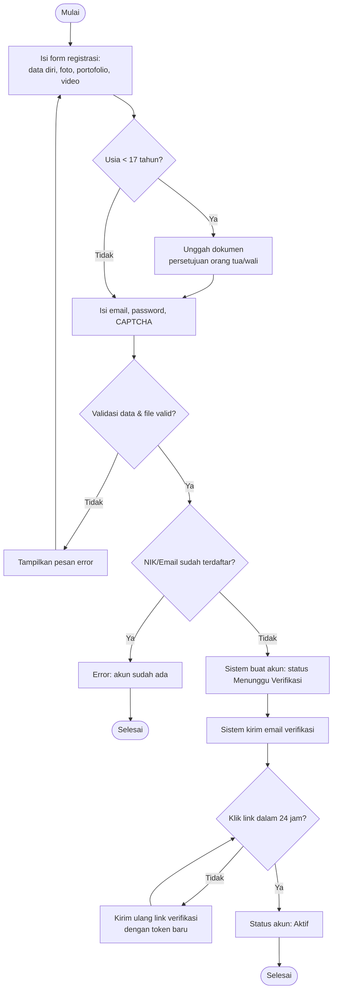
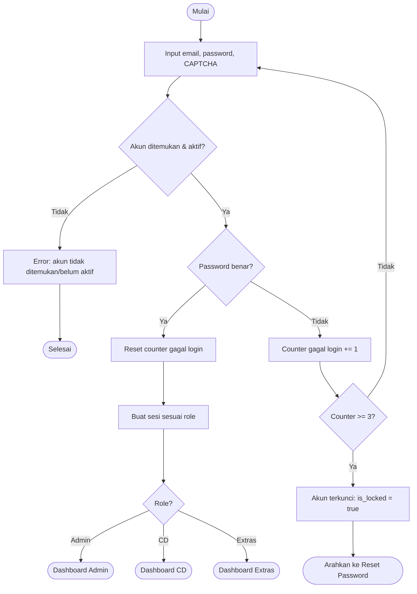
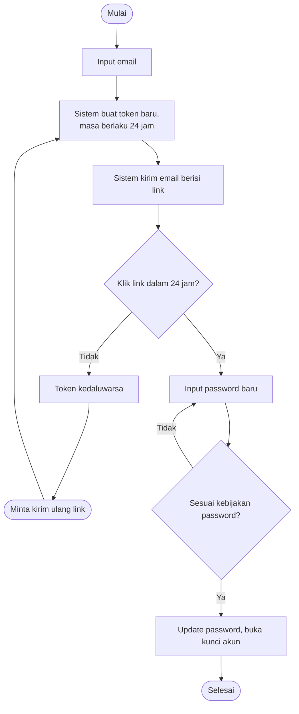
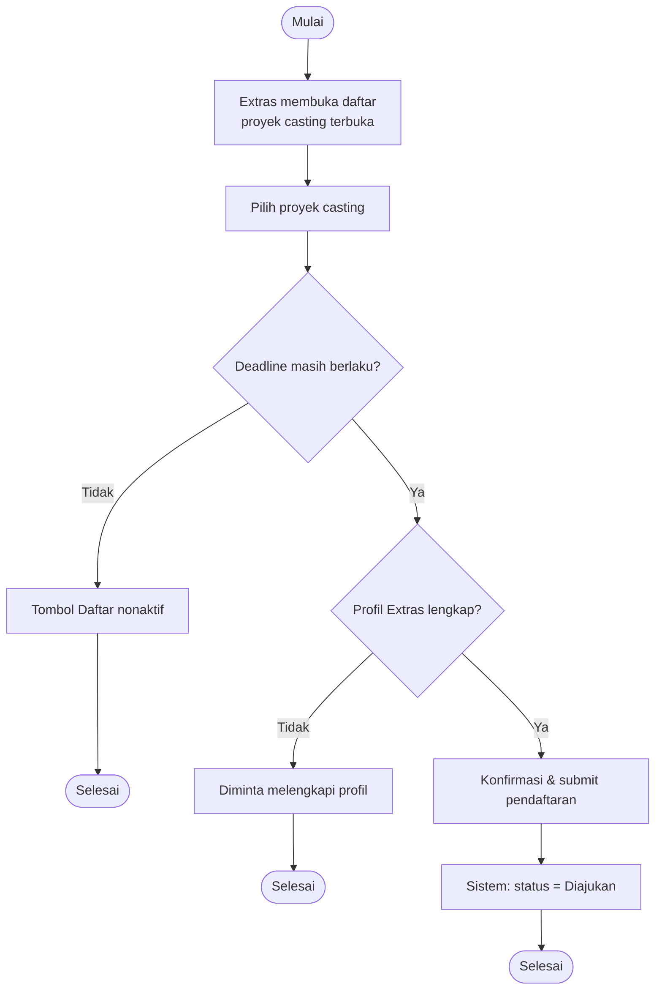
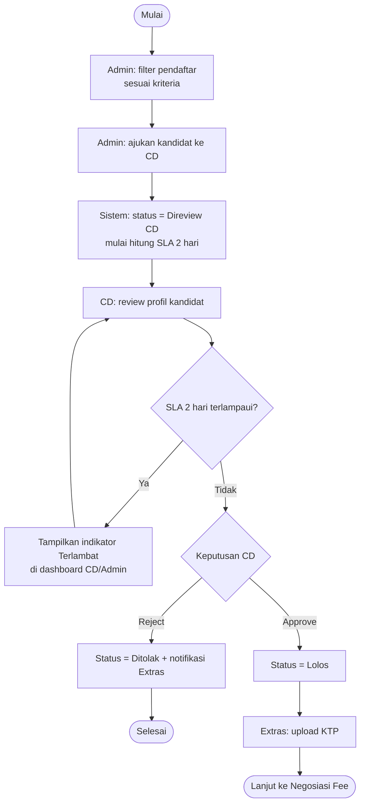
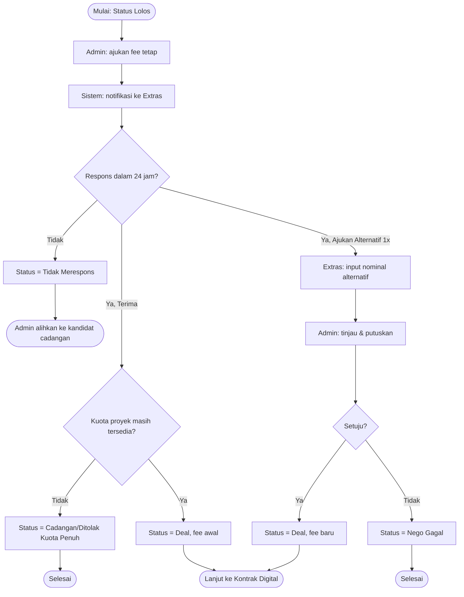
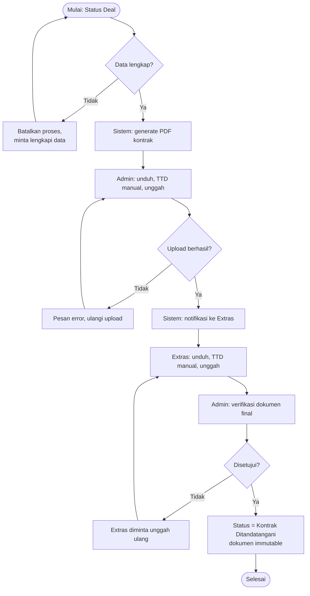
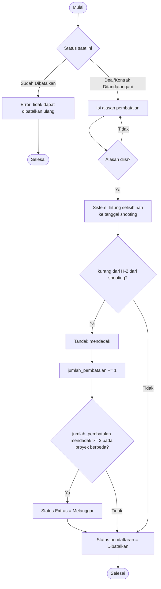
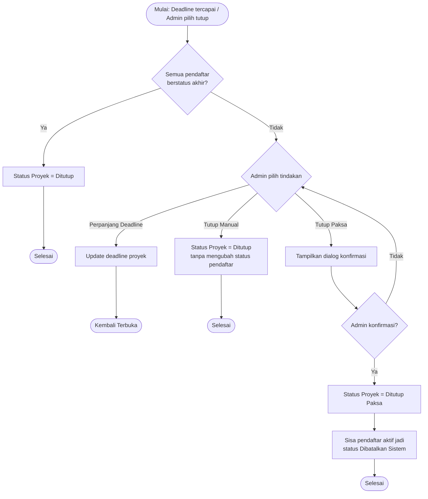

# User Flow Documentation
## Sistem Informasi Manajemen Casting Talent dan Extras Berbasis Web dengan Fitur Negosiasi Fee Digital

> **⚠️ SUPERSEDED (sebagian).** Flow berbasis desain 3-aktor lama (fee fixed, TTD upload scan, dsb). Acuan terkini: state machine `docs/CLAUDE.md` §6 (7 aktor, nego fee InDrive, canvas signature). Struktur/pola dokumentasi flow (preconditions, alternative/exception flow) masih berguna sebagai referensi format, tapi isi aktor/alur bisnisnya jangan dipakai langsung.

Dokumen ini mendefinisikan 9 user flow utama sistem, masing-masing dengan Flow Name, Actor, Trigger, Preconditions, Main Flow, Alternative Flow, Exception Flow, Validation Rules, Error Scenario, Post Conditions, dan Mermaid Flowchart.

---

## Flow 1 — Registrasi Extras

| Item | Deskripsi |
|---|---|
| **Flow Name** | Registrasi Mandiri Extras |
| **Actor** | Extras (calon pengguna publik) |
| **Trigger** | Pengguna mengakses halaman registrasi dan mengisi form pendaftaran |
| **Preconditions** | Belum memiliki akun terdaftar dengan NIK/email yang sama |
| **Main Flow** | 1. Isi data diri, foto, portofolio, video profil 2. Isi email & password 3. Selesaikan CAPTCHA 4. Submit form 5. Sistem kirim email verifikasi 6. Pengguna klik link verifikasi 7. Akun berstatus "Aktif" |
| **Alternative Flow** | Jika usia < 17 tahun → sistem meminta unggah dokumen persetujuan orang tua/wali sebelum submit dapat dilanjutkan (RF-54) |
| **Exception Flow** | - Link verifikasi kadaluarsa (>24 jam) → pengguna dapat meminta kirim ulang link dengan token baru (RF-51) - Email belum dikonfirmasi → akses fitur lain tetap terkunci |
| **Validation Rules** | NIK unik (RF-03); email format valid & unik; password minimal 8 karakter + kapital + angka + simbol (RF-57); whitelist tipe file: foto (jpg/png), video (mp4) serta batas ukuran maksimum (RF-44) |
| **Error Scenario** | - NIK/email sudah terdaftar → pesan error - Tipe/ukuran file tidak sesuai → pesan error & diminta unggah ulang - CAPTCHA gagal → diminta ulangi |
| **Post Conditions** | Akun Extras tercipta dengan status "Menunggu Verifikasi" → berubah "Aktif" setelah email diverifikasi |

---

## Flow 2 — Login & Proteksi Akun

| Item | Deskripsi |
|---|---|
| **Flow Name** | Login dengan Proteksi Brute-Force |
| **Actor** | Admin, Casting Director, Extras |
| **Trigger** | Pengguna mengakses halaman login dan submit kredensial |
| **Preconditions** | Akun sudah terdaftar dan berstatus aktif (khusus Extras: email sudah terverifikasi) |
| **Main Flow** | 1. Input email & password 2. Selesaikan CAPTCHA 3. Submit 4. Sistem validasi kredensial 5. Redirect ke dashboard sesuai role |
| **Alternative Flow** | Akun Extras belum verifikasi email → diarahkan ke halaman "kirim ulang verifikasi" |
| **Exception Flow** | Password salah 3x berturut-turut → akun terkunci sementara (RF-58); pengguna diarahkan ke reset password atau menunggu Admin membuka kunci |
| **Validation Rules** | Kombinasi email & password harus cocok; CAPTCHA valid |
| **Error Scenario** | - Kredensial salah → pesan error + counter percobaan bertambah - Akun terkunci → pesan "Akun terkunci, silakan reset password" |
| **Post Conditions** | Sesi (session) pengguna terbentuk sesuai role; atau akun berstatus terkunci (`is_locked = true`) |

---

## Flow 3 — Forgot Password / Kirim Ulang Verifikasi

| Item | Deskripsi |
|---|---|
| **Flow Name** | Pemulihan Akun (Forgot Password & Resend Verification) |
| **Actor** | Admin, Casting Director, Extras |
| **Trigger** | Pengguna klik "Lupa Password" atau "Kirim Ulang Email Verifikasi" |
| **Preconditions** | Akun dengan email tersebut terdaftar di sistem |
| **Main Flow** | 1. Input email 2. Sistem membuat token reset/verifikasi baru dengan masa berlaku 24 jam 3. Sistem kirim email berisi link 4. Pengguna klik link 5. Untuk reset password: input password baru sesuai kebijakan 6. Submit → password/akun diperbarui |
| **Alternative Flow** | Link belum diterima/hilang → pengguna dapat meminta kirim ulang (token lama otomatis tidak berlaku) |
| **Exception Flow** | Token kadaluarsa (>24 jam) → link tidak valid, pengguna diminta memulai proses ulang |
| **Validation Rules** | Password baru wajib memenuhi kebijakan: min. 8 karakter, 1 kapital, 1 angka, 1 simbol (RF-57) |
| **Error Scenario** | - Email tidak terdaftar → pesan generik (tidak mengonfirmasi/menyangkal keberadaan akun, demi keamanan) - Token kadaluarsa → pesan "Link telah kedaluwarsa" |
| **Post Conditions** | Password diperbarui dan akun otomatis terbuka (`is_locked = false`) jika sebelumnya terkunci; atau akun terverifikasi |

---

## Flow 4 — Pendaftaran Extras pada Proyek Casting

| Item | Deskripsi |
|---|---|
| **Flow Name** | Pendaftaran Extras pada Proyek Casting |
| **Actor** | Extras |
| **Trigger** | Extras memilih proyek casting yang terbuka dan menekan tombol "Daftar" |
| **Preconditions** | Akun aktif & profil lengkap; proyek berstatus "Terbuka" dan belum melewati deadline |
| **Main Flow** | 1. Extras membuka daftar proyek casting terbuka 2. Memilih satu proyek 3. Mengonfirmasi data profil yang akan diajukan 4. Submit pendaftaran 5. Sistem menyimpan status "Diajukan" |
| **Alternative Flow** | Extras dapat mendaftar ke beberapa proyek sekaligus secara paralel (multi-proyek diperbolehkan) |
| **Exception Flow** | Deadline proyek sudah lewat → tombol "Daftar" nonaktif, pesan informasi ditampilkan |
| **Validation Rules** | Profil Extras harus sudah lengkap (data wajib RF-06 terisi) sebelum dapat mendaftar |
| **Error Scenario** | - Proyek sudah ditutup di antara waktu Extras membuka halaman dan submit → pesan error "Proyek telah ditutup" |
| **Post Conditions** | Baris data `pendaftaran` baru tercipta dengan status "Diajukan"; proyek dapat mulai difilter oleh Admin |

---

## Flow 5 — Seleksi Kandidat (Filter Admin → Review CD)

| Item | Deskripsi |
|---|---|
| **Flow Name** | Seleksi Kandidat: Filter Admin dan Review Casting Director |
| **Actor** | Admin Agensi, Casting Director |
| **Trigger** | Admin membuka daftar pendaftar suatu proyek casting |
| **Preconditions** | Proyek casting memiliki pendaftar berstatus "Diajukan" |
| **Main Flow** | 1. Admin memfilter pendaftar sesuai kriteria proyek 2. Admin mengajukan kandidat terpilih ke CD (status → "Direview CD") 3. CD meninjau profil kandidat 4. CD memutuskan Approve/Reject 5. Sistem memperbarui status & mengirim notifikasi ke Extras |
| **Alternative Flow** | Jika kandidat "Lolos" dan usia < 17 tahun, sistem mewajibkan verifikasi ulang kelengkapan dokumen wali sebelum lanjut ke tahap fee |
| **Exception Flow** | Review CD melewati SLA 2 hari → sistem menampilkan indikator "Terlambat" pada dashboard CD dan Admin (tidak menghentikan proses, hanya penanda) |
| **Validation Rules** | Filter kriteria harus sesuai field kriteria proyek (usia, gender, tinggi, dll.) |
| **Error Scenario** | CD menolak kandidat tanpa alasan wajib → sistem tetap memproses namun disarankan mengisi catatan untuk audit |
| **Post Conditions** | Status pendaftar menjadi "Lolos" (lanjut ke Negosiasi Fee) atau "Ditolak" (proses berakhir) |

---

## Flow 6 — Negosiasi Fee Digital

| Item | Deskripsi |
|---|---|
| **Flow Name** | Negosiasi Fee Digital |
| **Actor** | Admin Agensi, Extras |
| **Trigger** | Kandidat dinyatakan "Lolos" oleh CD |
| **Preconditions** | Status pendaftaran = "Lolos"; KTP telah diunggah |
| **Main Flow** | 1. Admin mengajukan fee tetap 2. Extras meninjau tawaran 3. Extras memilih Terima atau Ajukan Fee Alternatif 4. Jika Terima → status "Deal" 5. Jika Ajukan Alternatif → Admin memutuskan setuju/tolak (final) |
| **Alternative Flow** | Jika kuota proyek sudah tercapai oleh pendaftar lain yang lebih dulu "Deal" → status otomatis "Cadangan (Back Up)" atau "Ditolak (Kuota Penuh)" |
| **Exception Flow** | Extras tidak merespons dalam 24 jam → status "Tidak Merespons"; Admin dapat mengalihkan tawaran ke kandidat cadangan |
| **Validation Rules** | Pengajuan fee alternatif hanya dapat dilakukan **maksimal 1 kali** per pendaftaran |
| **Error Scenario** | Extras mencoba mengajukan fee alternatif kedua kalinya → sistem menolak dan menampilkan pesan bahwa kesempatan sudah digunakan |
| **Post Conditions** | Status "Deal" dengan fee final tercatat (lanjut ke Kontrak Digital), atau "Tidak Merespons"/"Nego Gagal" |

---

## Flow 7 — Kontrak Digital

| Item | Deskripsi |
|---|---|
| **Flow Name** | Pembuatan & Penandatanganan Kontrak Digital |
| **Actor** | Admin Agensi, Extras |
| **Trigger** | Status pendaftaran berubah menjadi "Deal" |
| **Preconditions** | Fee final telah disepakati; data Extras & proyek lengkap |
| **Main Flow** | 1. Sistem generate PDF kontrak dari template 2. Admin unduh, TTD manual, unggah PDF ber-TTD Admin 3. Sistem notifikasi ke Extras 4. Extras unduh, TTD manual, unggah PDF ber-TTD lengkap 5. Admin memverifikasi dokumen 6. Jika disetujui → status "Kontrak Ditandatangani", dokumen immutable |
| **Alternative Flow** | Admin dapat mengelola/mengedit template kontrak sebelum proses generate dilakukan |
| **Exception Flow** | - Data tidak lengkap saat generate → proses dibatalkan, diminta melengkapi data (RF-68) - Admin menolak verifikasi dokumen final → Extras diminta unggah ulang |
| **Validation Rules** | File yang diunggah harus format PDF, sesuai batas ukuran maksimum (RF-44) |
| **Error Scenario** | Upload gagal (koneksi terputus) → sistem menampilkan pesan error standar, tanpa resume otomatis (RF-69) |
| **Post Conditions** | Status "Kontrak Ditandatangani"; dokumen kontrak final tidak dapat diedit/dihapus (`is_immutable = true`) |

---

## Flow 8 — Pembatalan (Cancel)

| Item | Deskripsi |
|---|---|
| **Flow Name** | Pembatalan Keikutsertaan (Cancel) |
| **Actor** | Admin Agensi, Extras |
| **Trigger** | Salah satu pihak mengajukan pembatalan pada pendaftaran berstatus "Deal" atau "Kontrak Ditandatangani" |
| **Preconditions** | Status pendaftaran = "Deal" atau "Kontrak Ditandatangani" |
| **Main Flow** | 1. Pihak yang membatalkan mengisi alasan 2. Submit permintaan pembatalan 3. Sistem menghitung selisih waktu ke tanggal shooting 4. Sistem menandai "mendadak" jika < H-2 5. Status pendaftaran → "Dibatalkan" |
| **Alternative Flow** | Jika kontrak sudah berstatus immutable, dokumen kontrak tetap tersimpan sebagai arsip meskipun pendaftaran dibatalkan (dokumen tidak dihapus) |
| **Exception Flow** | Pendaftaran yang sudah berstatus "Dibatalkan" tidak dapat dibatalkan ulang |
| **Validation Rules** | Alasan pembatalan wajib diisi |
| **Error Scenario** | Percobaan submit tanpa alasan → sistem menolak dan meminta alasan diisi |
| **Post Conditions** | Status = "Dibatalkan"; jika "mendadak", `jumlah_pembatalan` Extras bertambah 1 — jika mencapai 3x pada proyek berbeda, status Extras otomatis "Melanggar" |

---

## Flow 9 — Penutupan Proyek Casting

| Item | Deskripsi |
|---|---|
| **Flow Name** | Penutupan Proyek Casting |
| **Actor** | Admin Agensi |
| **Trigger** | Deadline proyek tercapai, atau Admin memilih menutup proyek secara manual |
| **Preconditions** | Proyek berstatus "Terbuka" |
| **Main Flow** | 1. Sistem mengecek apakah seluruh pendaftar sudah berstatus akhir (Deal/Ditolak/Dibatalkan) 2. Jika ya → proyek otomatis berstatus "Ditutup" 3. Jika tidak → Admin memilih: perpanjang deadline, atau tutup manual |
| **Alternative Flow** | Admin dapat memilih **"Tutup Paksa"** meskipun masih ada pendaftar aktif |
| **Exception Flow** | Tutup Paksa memerlukan **konfirmasi eksplisit** dari Admin sebelum dieksekusi |
| **Validation Rules** | Opsi "Tutup Paksa" wajib menampilkan dialog konfirmasi sebelum dieksekusi |
| **Error Scenario** | Admin membatalkan konfirmasi Tutup Paksa → proyek tetap berstatus "Terbuka" |
| **Post Conditions** | Proyek berstatus "Ditutup" (normal) atau "Ditutup Paksa"; jika Tutup Paksa → seluruh pendaftar aktif tersisa otomatis berstatus "Dibatalkan Sistem" |

---

## Ringkasan Cakupan

| # | Flow | Modul Terkait |
|---|---|---|
| 1 | Registrasi Extras | Autentikasi & Akun |
| 2 | Login & Proteksi Akun | Autentikasi & Akun |
| 3 | Forgot Password / Resend Verification | Autentikasi & Akun |
| 4 | Pendaftaran Proyek Casting | Pendaftaran & Seleksi |
| 5 | Seleksi Kandidat (Filter → Review) | Pendaftaran & Seleksi |
| 6 | Negosiasi Fee Digital | Negosiasi Fee Digital |
| 7 | Kontrak Digital | Kontrak Digital |
| 8 | Pembatalan (Cancel) | Pembatalan |
| 9 | Penutupan Proyek Casting | Manajemen Proyek Casting |

Seluruh flow di atas konsisten dengan RF-01–70 dan RNF-01–18 pada dokumen SRS (`16-SRS-IEEE29148-Final.md`).
