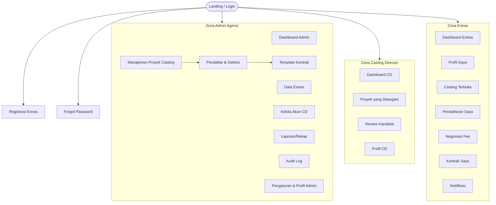
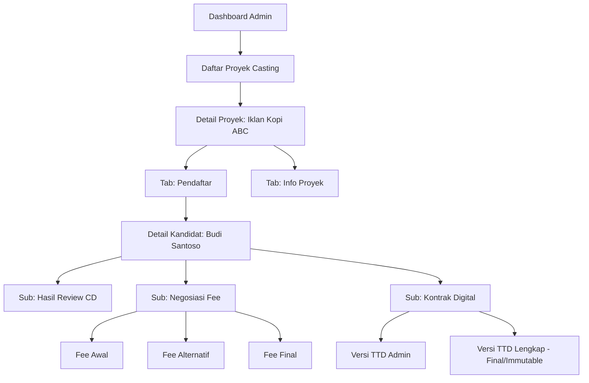

# Information Architecture
## Sistem Informasi Manajemen Casting Talent dan Extras Berbasis Web dengan Fitur Negosiasi Fee Digital

---

## 1. Sitemap



---

## 2. Navigation Structure

| Level | Elemen | Keterangan |
|---|---|---|
| **Primary Navigation** | Sidebar (desktop) / Drawer menu (mobile) berisi menu utama sesuai role | Berbeda isi per role: Admin, CD, Extras |
| **Secondary Navigation** | Tab di dalam halaman detail (mis. Detail Proyek Casting → tab "Info Proyek", "Pendaftar", "Rekap") | Kontekstual per modul |
| **Utility Navigation** | Ikon notifikasi, profil akun, logout — selalu terlihat di topbar | Sama di semua role |
| **Contextual Navigation** | Tombol aksi (mis. "Ajukan ke CD", "Generate Kontrak") muncul sesuai status data saat itu | Berbasis state pendaftaran |

---

## 3. Menu Structure

### 3.1 Menu Admin Agensi
```
Dashboard
Proyek Casting
 ├─ Daftar Proyek
 └─ Buat Proyek Baru
Pendaftar & Seleksi
 ├─ Filter & Ajukan ke CD
 ├─ Negosiasi Fee
 └─ Kontrak Digital
Template Kontrak
Data Extras
 ├─ Daftar Extras
 └─ Status Keaktifan
Kelola Akun CD
Laporan
 ├─ Rekap Keterpilihan
 ├─ Rekap Keaktifan
 ├─ Laporan Funnel
 └─ Rekap Fee
Audit Log
Pengaturan
 ├─ Link Grup WA per Proyek
 └─ Profil Admin
```

### 3.2 Menu Casting Director
```
Dashboard
Proyek Saya
 └─ Daftar Kandidat per Proyek
Review Kandidat
Profil Saya
```

### 3.3 Menu Extras
```
Dashboard
Profil Saya
Casting Terbuka
Pendaftaran Saya
 ├─ Status Seleksi
 ├─ Negosiasi Fee
 └─ Kontrak Digital
Notifikasi
Keamanan Akun (ganti password)
```

---

## 4. Module Structure

| Modul | Sub-Modul |
|---|---|
| Autentikasi & Akun | Registrasi, Login, Verifikasi Email, Forgot Password, Kunci Akun |
| Profil Extras | Data Diri, Foto & Video, Dokumen Persetujuan Wali |
| Manajemen Proyek Casting | CRUD Proyek, Kuota, Deadline, Kebijakan Penutupan |
| Pendaftaran & Seleksi | Filter Kandidat, Ajukan ke CD, Review, Approve/Reject |
| Negosiasi Fee Digital | Ajukan Fee, Respons Extras, Keputusan Final, Konfirmasi Pembayaran |
| Kontrak Digital | Template Kontrak, Generate PDF, Upload TTD, Verifikasi Admin |
| Pembatalan | Pengajuan Cancel, Klasifikasi Mendadak |
| Notifikasi | Email, Web Push, Link Grup WA |
| Dashboard | Dashboard Admin/CD/Extras |
| Laporan/Rekap | Keterpilihan, Keaktifan, Funnel, Fee |
| Audit & Keamanan | Audit Log, RBAC, Field-Level Permission |

---

## 5. Screen Inventory

*(Screen = unit tampilan/interaksi UI, termasuk modal & state di dalam satu halaman)*

| Kode | Nama Screen | Tipe | Modul |
|---|---|---|---|
| SC-01 | Form Registrasi Extras | Form multi-step | Autentikasi |
| SC-02 | Modal Unggah Dokumen Wali | Modal | Autentikasi |
| SC-03 | Form Login | Form | Autentikasi |
| SC-04 | Alert Akun Terkunci | Alert/Banner | Autentikasi |
| SC-05 | Form Forgot Password | Form | Autentikasi |
| SC-06 | Card Ringkasan Dashboard | Widget | Dashboard |
| SC-07 | Form Buat/Edit Proyek Casting | Form | Manajemen Proyek |
| SC-08 | Tabel Pendaftar + Filter | Tabel interaktif | Pendaftaran & Seleksi |
| SC-09 | Detail Kandidat (Review CD) | Detail view | Pendaftaran & Seleksi |
| SC-10 | Indikator "Terlambat" / "Tidak Merespons" | Badge/Indicator | Pendaftaran & Seleksi |
| SC-11 | Modal Ajukan Fee | Modal | Negosiasi Fee |
| SC-12 | Modal Respons Fee (Terima/Alternatif) | Modal | Negosiasi Fee |
| SC-13 | Editor Template Kontrak | Rich text editor | Kontrak Digital |
| SC-14 | Preview & Unggah PDF Kontrak | Upload widget | Kontrak Digital |
| SC-15 | Modal Verifikasi Kontrak (Admin) | Modal | Kontrak Digital |
| SC-16 | Modal Ajukan Pembatalan | Modal | Pembatalan |
| SC-17 | Panel Notifikasi | Dropdown/Panel | Notifikasi |
| SC-18 | Tabel Laporan + Ekspor Excel | Tabel + tombol ekspor | Laporan |
| SC-19 | Tabel Audit Log | Tabel read-only | Audit |

---

## 6. Page Inventory

*(Page = halaman penuh yang dapat diakses via URL/menu)*

| Kode | Nama Halaman | Role | Deskripsi |
|---|---|---|---|
| P-01 | Landing/Login | Publik | Halaman masuk seluruh aktor |
| P-02 | Registrasi Extras | Publik | Form pendaftaran mandiri |
| P-03 | Verifikasi Email | Publik | Konfirmasi token verifikasi |
| P-04 | Forgot/Reset Password | Publik | Pemulihan akun |
| P-05 | Dashboard Admin | Admin | Ringkasan operasional |
| P-06 | Daftar Proyek Casting | Admin | List + aksi CRUD |
| P-07 | Detail Proyek Casting | Admin | Info proyek + tab pendaftar |
| P-08 | Pendaftar & Seleksi | Admin | Filter, ajukan ke CD |
| P-09 | Negosiasi Fee (per pendaftar) | Admin | Ajukan & putuskan fee |
| P-10 | Kontrak Digital (per pendaftar) | Admin | Generate, verifikasi kontrak |
| P-11 | Template Kontrak | Admin | CRUD template |
| P-12 | Data Extras | Admin | List & detail profil (termasuk KTP) |
| P-13 | Kelola Akun CD | Admin | CRUD akun CD |
| P-14 | Laporan | Admin | 4 jenis laporan |
| P-15 | Audit Log | Admin | Read-only log |
| P-16 | Pengaturan | Admin | Link WA, profil |
| P-17 | Dashboard CD | CD | Ringkasan proyek ditangani |
| P-18 | Proyek Saya (CD) | CD | List proyek & kandidat |
| P-19 | Review Kandidat | CD | Approve/reject |
| P-20 | Dashboard Extras | Extras | Ringkasan status |
| P-21 | Profil Saya | Extras | Edit profil (terbatas pasca-lolos) |
| P-22 | Casting Terbuka | Extras | List proyek terbuka + daftar |
| P-23 | Pendaftaran Saya | Extras | Riwayat & status |
| P-24 | Detail Pendaftaran (Fee & Kontrak) | Extras | Respons fee, upload kontrak |
| P-25 | Notifikasi | Extras/CD/Admin | List notifikasi |

---

## 7. Permission Matrix

| Halaman/Modul | Admin | CD | Extras |
|---|:---:|:---:|:---:|
| P-05/17/20 Dashboard | ✅ (miliknya) | ✅ (miliknya) | ✅ (miliknya) |
| P-06/07 Proyek Casting (CRUD) | ✅ Penuh | 👁️ Lihat saja (miliknya) | 👁️ Lihat (terbuka saja) |
| P-08 Filter & Ajukan Kandidat | ✅ | — | — |
| P-19 Review Kandidat | 👁️ Lihat hasil | ✅ | 👁️ Status sendiri |
| P-09 Negosiasi Fee | ✅ Ajukan/putuskan | — | ✅ Respons sendiri |
| P-10 Kontrak Digital | ✅ Generate/verifikasi | — | ✅ Upload sendiri |
| P-11 Template Kontrak | ✅ | — | — |
| P-12 Data Extras (termasuk KTP) | ✅ **hanya Admin** | ❌ | ✅ (data sendiri) |
| P-13 Kelola Akun CD | ✅ | — | — |
| P-14 Laporan (Funnel & Fee) | ✅ **hanya Admin** | ❌ | ❌ |
| P-15 Audit Log | ✅ **hanya Admin** | ❌ | ❌ |
| P-16 Pengaturan | ✅ | — | — |
| P-21 Profil Extras | 👁️ Lihat (tanpa NIK jika bukan Admin) | 👁️ Data relevan casting saja | ✅ Kelola sendiri |
| P-25 Notifikasi | ✅ milik sendiri | ✅ milik sendiri | ✅ milik sendiri |

Legenda: ✅ akses penuh · 👁️ lihat terbatas · ❌ tidak dapat diakses · — tidak relevan/tidak tersedia

---

## 8. Taxonomy

| Kategori | Nilai/Klasifikasi |
|---|---|
| **Status Pendaftaran** | Diajukan · Direview CD (Terlambat) · Lolos · Ditolak · Nego Fee (Tidak Merespons) · Deal · Cadangan (Back Up) · Ditolak (Kuota Penuh) · Kontrak Ditandatangani · Selesai Produksi · Dibatalkan · Dibatalkan Sistem |
| **Status Keaktifan Extras** | Aktif · Tidak Aktif · Melanggar |
| **Status Proyek** | Terbuka · Ditutup · Ditutup Paksa |
| **Kriteria Seleksi Extras** | Usia, Gender, Tinggi Badan, Ukuran Baju, Warna Kulit, Pengalaman, Bahasa |
| **Jenis Notifikasi** | Hasil Seleksi, Konfirmasi Fee, Kontrak Siap TTD, Pengingat Deadline (H-3/H-1), Pelanggaran SLA, Status Cadangan |
| **Kanal Notifikasi** | Email, Web Push, Link Grup WA (manual) |
| **Jenis Laporan** | Rekap Keterpilihan, Rekap Keaktifan, Funnel per Proyek, Rekap Fee |
| **Tipe File** | Foto (jpg/png), Video Profil (mp4), Dokumen (pdf: KTP, Kontrak, Persetujuan Wali) |

---

## 9. Content Hierarchy

```
Proyek Casting
 └─ Pendaftar (banyak Extras per proyek)
     ├─ Data Profil Extras
     ├─ Hasil Review CD
     ├─ Riwayat Negosiasi Fee
     │   └─ Fee Awal → Fee Alternatif (opsional) → Fee Final
     ├─ Dokumen Kontrak
     │   └─ Versi TTD Admin → Versi TTD Lengkap (Final, immutable)
     └─ Riwayat Pembatalan (jika ada)
```

Struktur ini mencerminkan **Pendaftaran** sebagai entitas hub (lihat ERD), sehingga navigasi konten pada UI juga berpusat pada halaman Detail Pendaftaran per Extras di dalam suatu proyek.

---

## 10. Mobile Navigation

Karena sistem harus responsif di mobile browser (RNF-05/RNF-08), pola navigasi mobile:

- **Bottom Navigation Bar** (4–5 ikon utama sesuai role):
  - *Extras:* Dashboard · Casting Terbuka · Pendaftaran Saya · Notifikasi · Profil
  - *Admin:* Dashboard · Proyek · Pendaftar · Laporan · Menu Lainnya (hamburger)
  - *CD:* Dashboard · Proyek Saya · Review · Profil
- **Hamburger Menu** (☰) di topbar untuk menu sekunder (Pengaturan, Audit Log, Kelola Akun CD, dll. — item yang tidak muat di bottom nav).
- **Swipe/Tab** digunakan pada halaman Detail Pendaftaran (tab: Info · Fee · Kontrak) agar tetap ringkas di layar sempit.

---

## 11. Desktop Navigation

- **Sidebar kiri (persistent/collapsible)** berisi menu utama sesuai Menu Structure (§3), dikelompokkan per modul dengan collapsible section.
- **Topbar** berisi: logo, breadcrumb, ikon notifikasi (dengan badge jumlah belum dibaca), ikon profil & logout.
- **Konten utama** memakai layout tabel/kartu dengan panel filter di sisi kanan/atas untuk modul dengan data banyak (Pendaftar, Data Extras, Laporan).
- **Tab horizontal** pada halaman detail (Detail Proyek Casting, Detail Pendaftaran) untuk navigasi kontekstual antar sub-konten.

---

## 12. URL Structure

Mengikuti konvensi RESTful Laravel:

| Halaman | URL Pattern |
|---|---|
| Login | `/login` |
| Registrasi | `/register` |
| Verifikasi Email | `/email/verify/{token}` |
| Forgot/Reset Password | `/password/forgot`, `/password/reset/{token}` |
| Dashboard Admin | `/admin/dashboard` |
| Daftar Proyek Casting | `/admin/proyek-casting` |
| Detail Proyek Casting | `/admin/proyek-casting/{id}` |
| Pendaftar per Proyek | `/admin/proyek-casting/{id}/pendaftar` |
| Detail Negosiasi Fee | `/admin/pendaftaran/{id}/fee` |
| Detail Kontrak | `/admin/pendaftaran/{id}/kontrak` |
| Template Kontrak | `/admin/template-kontrak` |
| Data Extras | `/admin/extras`, `/admin/extras/{id}` |
| Kelola Akun CD | `/admin/casting-director` |
| Laporan | `/admin/laporan/{jenis}` (`keterpilihan`, `keaktifan`, `funnel`, `fee`) |
| Audit Log | `/admin/audit-log` |
| Dashboard CD | `/cd/dashboard` |
| Review Kandidat | `/cd/proyek/{id}/kandidat/{id}` |
| Dashboard Extras | `/extras/dashboard` |
| Casting Terbuka | `/extras/casting` |
| Detail Casting | `/extras/casting/{id}` |
| Pendaftaran Saya | `/extras/pendaftaran` |
| Detail Pendaftaran (Fee/Kontrak) | `/extras/pendaftaran/{id}` |
| Notifikasi | `/notifikasi` (shared route, konten sesuai role login) |

---

## 13. Breadcrumb Strategy

Pola: `Dashboard > [Modul] > [Sub-Modul] > [Detail]`

Contoh:
- `Dashboard Admin > Proyek Casting > Iklan Kopi ABC > Pendaftar`
- `Dashboard Admin > Proyek Casting > Iklan Kopi ABC > Pendaftar > Budi Santoso > Negosiasi Fee`
- `Dashboard Extras > Pendaftaran Saya > Iklan Kopi ABC > Kontrak`
- `Dashboard CD > Proyek Saya > Iklan Kopi ABC > Review Kandidat`

**Aturan:**
1. Level pertama selalu "Dashboard [Role]" sebagai jangkar (anchor) navigasi pulang.
2. Breadcrumb menampilkan **nama entitas** (nama proyek/nama extras), bukan ID teknis.
3. Maksimal 4 level agar tidak memenuhi layar mobile; level ke-5+ digantikan tab kontekstual (lihat §10).

---

## 14. Tree Diagram

Diagram pohon berikut menunjukkan kedalaman navigasi contoh alur Admin dari Dashboard hingga ke Negosiasi Fee & Kontrak per kandidat:



---

## Ringkasan

Information Architecture ini konsisten dengan struktur modul, role, dan permission yang telah didefinisikan pada dokumen SRS (`16-SRS-IEEE29148-Final.md`) dan User Flow (`17-User-Flow-Documentation.md`), serta siap digunakan sebagai acuan desain wireframe/UI (Design System) pada tahap berikutnya.
