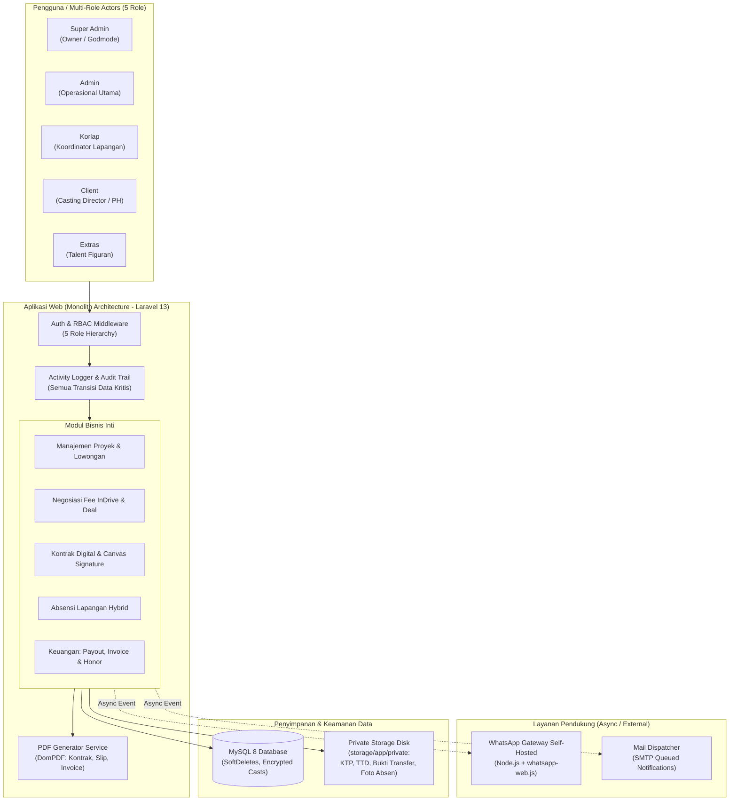
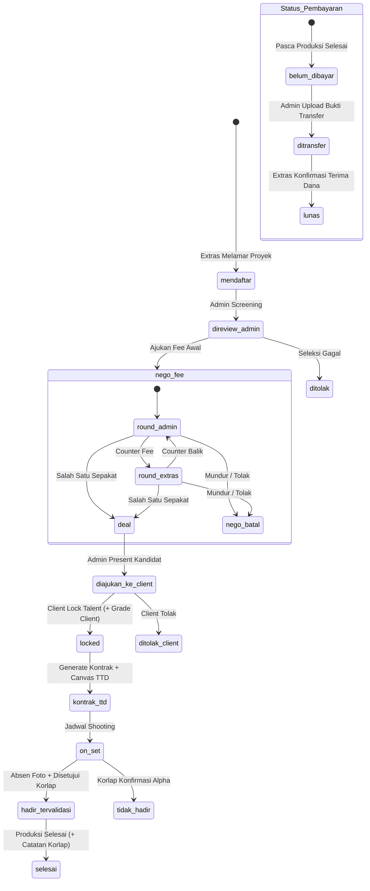
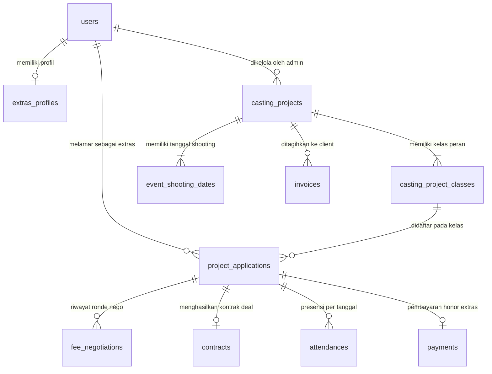

# SYSTEM-ARCHITECTURE.md — SIM Casting JBTB

> **Status Dokumen:** Master Architecture & Requirement Specification (Resmi per 21 September 2026)  
> **Dasar Keputusan:** Hasil sintesis Catatan Bimbingan Dosen (Erlina), Review Solution Architect, dan Validasi Stakeholder/Developer (Fakrul).  
> **Fungsi File:** Blueprint arsitektural resmi untuk implementasi sistem, acuan penulisan Bab 3 Skripsi/Project Work, dan panduan lintas sesi AI.

---

## 1. Problem Statement & Batasan Sistem (Scope Boundary)

### 1.1 Problem Statement
> *"Inefisiensi operasional dan potensi sengketa kesepakatan nominal fee pada proses penyaluran talent figuran (extras) dari agensi ke rumah produksi (PH) akibat ketergantungan pada media komunikasi terdistribusi (WhatsApp, Excel, Google Drive) yang tidak memiliki rekam jejak negosiasi formal, kontrak digital mengikat, serta pelacakan status pembayaran transparan."*

### 1.2 Boundary: In-Scope vs Out-of-Scope
Untuk menjaga sistem tetap fokus menyelesaikan masalah inti (*Core Value Proposition*) dan mencegah pembengkakan cakupan (*Scope Creep*):

| Kategori | Di Dalam Sistem (In-Scope) | Di Luar Sistem (Out-of-Scope) |
|---|---|---|
| **Manajemen Talent** | Registrasi, profil publik (token/username), portofolio, rate card, auto-archive akun mangkrak 30 hari. | Manajemen artis utama (pemeran utama/pro), manajemen kontrak eksklusif tahunan. |
| **Lowongan & Proyek** | Pembuatan proyek (dua pintu), penentuan kelas/kuota/budget, breakdown karakter & jam callingan. | Sistem manajemen produksi film lengkap (Full Script Breakdown, Scene Shot-list, Logistik/Catering, Unit Manager). |
| **Negosiasi & Kontrak** | Negosiasi fee multi-round ala InDrive (audit trail), Kontrak Digital (Talent Release) dengan Canvas Signature. | Tanda tangan digital PSrE berbayar (e.g. Privy/Peruri), tanda tangan kontrak di atas materai fisik. |
| **Lapangan (On-Set)** | Absensi hybrid (Kamera selfie extras anti-galeri + validasi Korlap), catatan lapangan & performa oleh Korlap. | Geofencing GPS real-time live-tracking, deteksi wajah AI (facial recognition). |
| **Keuangan & Invoice** | Dual-invoice: Invoice resmi JBTB (PDF) + lampiran template/voucher PH, bukti transfer payout extras, pencatatan honor staf & biaya tenaga tambahan. | Payment Gateway otomatis (Midtrans/Xendit), sistem penggajian formal HRIS (potongan PPh21, BPJS Ketenagakerjaan). |

---

## 2. High Level Design (HLD)

### 2.1 Diagram Arsitektur Sistem

---

## 3. Low Level Design (LLD) & State Machines

### 3.1 Dua Jalur Status Inti (Terpisah & Independen)

Sistem memisahkan secara ketat antara **Status Partisipasi Talent** dan **Status Keuangan Payout**:

---

## 4. Struktur Role & Hak Akses (RBAC 5 Role)

Role resmi dipangkas dari 7 menjadi **5 Role**:

| Role | Identitas & Tanggung Jawab | Akses Fitur Utama |
|---|---|---|
| **`super_admin`** | Owner JBTB (Jestika Aisya Kordak). | **Godmode:** Monitoring analitik, approval pengajuan proyek dari Client, kelola akun staf & billing, serta memiliki wewenang penuh mengeksekusi semua fitur Admin & Korlap. |
| **`admin`** | Staf Operasional Inti Agensi. | Buat/edit lowongan, seleksi & grading awal, negosiasi fee, present kandidat ke Client, terbitkan invoice, upload bukti transfer payout extras, rekap honor. |
| **`korlap`** | Koordinator Lapangan di Lokasi Syuting. | Dashboard callingan & karakter scene, validasi absensi foto extras on-set, input absensi manual darurat, input catatan & performa lapangan extras. |
| **`client`** | Casting Director / Tim Rumah Produksi (PH). | Submit brief permintaan proyek baru, review kandidat via nama panggung (alias), lock extras pilihan, beri grade visual Client, pantau foto kehadiran on-set, unduh invoice. |
| **`extras`** | Talent Figuran / Talent Komersial. | Registrasi akun & profil portofolio/rate card, lamar casting, tawar-menawar fee (InDrive), tanda tangan digital kontrak (canvas), absen selfie di set, konfirmasi penerimaan fee. |

> **Catatan Tenaga Tambahan (Talco, Sosmed, Runner):** Tidak memiliki role sistem tersendiri. Jika proyek membutuhkan tenaga tambahan, dicatat sebagai komponen biaya operasional proyek (*Project Add-on / Reimbursement*) oleh Admin/Super Admin.

---

## 5. Spesifikasi Logika Bisnis Kunci

### 5.1 Alur Mulai Proyek (Dua Pintu)
1. **Pintu 1 (Client Inception):** Client mengajukan brief proyek melalui formulir mandiri di sistem $\rightarrow$ Super Admin menerima notifikasi $\rightarrow$ Super Admin me-review & klik **ACC Proyek** $\rightarrow$ Data masuk ke antrean Admin untuk dilengkapi kelas, budget, dan callingannya.
2. **Pintu 2 (Direct Admin Inception):** Admin atau Super Admin dapat langsung membuat proyek secara mandiri tanpa menunggu pengajuan Client (untuk pesanan via WhatsApp/telepon/meeting offline).

### 5.2 Grade vs Performa Lapangan (Pemisahan Tanggung Jawab)
* **Grade (A/B/C) = Kualitas Visual & Akting:**
  * Ditentukan murni dari penampilan/look, kerapihan visual, dan kemampuan akting.
  * Dinilai oleh **Admin** saat seleksi, lalu dikonfirmasi/disesuaikan oleh **Client** saat status *Lock*.
  * Mengunci selama 2 bulan di profil Extras untuk menjaga konsistensi reputasi talent.
* **Evaluasi Lapangan (Korlap) = Kinerja & Sikap di Lokasi (Attitude):**
  * Korlap **tidak mengubah** Grade visual A/B/C.
  * Korlap mengisi evaluasi lapangan pasca-syuting berupa:
    1. Status Kehadiran & Ketepatan Waktu (Otomatis dari jam absen vs callingan).
    2. Rating Sikap / Kedisiplinan di Set (Skala 1–5 bintang).
    3. Catatan lapangan kualitatif (opsional).

### 5.3 Callsheet, Rundown, dan Jam Callingan
* Sistem **BUKAN** generator callsheet produksi film.
* Format waktu produksi:
  * Admin menerima jam callsheet resmi dari Astrada/PH (misal: *Take kamera jam 07.00 WIB*).
  * Sistem otomatis menyarankan **Jam Callingan Extras = Jam Callsheet minus 1 Jam** (*06.00 WIB*) untuk mengantisipasi keterlambatan dan persiapan kostum/make-up.
  * Jam Callingan inilah yang tampil jelas di dashboard Extras dan Korlap.

### 5.4 Absensi Lapangan Hybrid
* **Alur Mandiri (Extras):** Extras membuka web di lokasi $\rightarrow$ memilih menu Absen Proyek $\rightarrow$ membuka kamera perangkat (khusus jepret langsung, proteksi anti-unggah galeri) $\rightarrow$ foto selfie dikirim bersama timestamp server $\rightarrow$ Muncul di dashboard Korlap dengan status *Menunggu Validasi*.
* **Alur Bantuan (Korlap On-Site):** Untuk extras yang tidak memiliki smartphone/kuota, Korlap dapat membuka menu presensi $\rightarrow$ mengambil foto extras di lokasi $\rightarrow$ menandai status *Hadir Langsung*.
* **Visibilitas Client:** Client dapat melihat galeri foto kehadiran extras on-set untuk verifikasi tagihan.

### 5.5 Manajemen Akun: Aturan 30 Hari vs Keep Data (SoftDeletes)
* **Aturan "Keep Data" (SoftDeletes):** Seluruh akun yang **sudah pernah memiliki riwayat aktivitas** (pernah melamar, pernah negosiasi, pernah ikut proyek) **HARAM dihapus permanen**. Aksi hapus akan menjalankan `SoftDeletes` (`deleted_at = now()`) agar audit trail keuangan dan hukum tidak hilang.
* **Aturan "Prune Akun Mangkrak 30 Hari":** Khusus untuk akun Extras yang:
  1. Terdaftar lebih dari 30 hari yang lalu (`created_at <= now() - 30 days`), DAN
  2. Profil tidak pernah dilengkapi, DAN
  3. Memiliki riwayat lamaran nol (`applications_count == 0`).
  Akun kategori ini dapat di-purge atau diarsipkan otomatis demi efisiensi storage tanpa mengganggu integritas database.

### 5.6 Tanda Urgent Otomatis & Reminder Admin
* Proyek secara otomatis menyandang status **🚨 URGENT** jika:
  $$\text{Tanggal Shooting Terdekat} - \text{Hari Ini} \le 3 \text{ Hari} \quad \text{DAN} \quad \text{Sisa Kuota} > 0$$
* Ditampilkan sebagai badge visual dinamis dan memunculkan banner peringatan di dashboard Admin tanpa membutuhkan scheduler cron yang berat.

---

## 6. Tabel Database Inti (11 Core Conceptual Tables)

Untuk keperluan penulisan **Bab 3 Skripsi (ERD Konseptual & Class Diagram)**, sistem berpusat pada 11 tabel utama:

1. **`users`**: Entitas akun sentral, menyimpan kredensial, role enum (`super_admin`, `admin`, `korlap`, `client`, `extras`), status, dan timestamp `deleted_at` (`SoftDeletes`).
2. **`extras_profiles`**: Data biodata lengkap extras, visual, rate card, enkripsi NIK & nomor rekening, grade saat ini, token share publik.
3. **`casting_projects`**: Proyek film/iklan, judul, deskripsi, cover, status, penugasan client (`client_id`), link grup WA.
4. **`casting_project_classes`**: Kategori peran (e.g. Warga, Polisi), kuota, budget client, nominal payout agensi, jam callingan, continuity/free.
5. **`event_shooting_dates`**: Tanggal-tanggal pelaksanaan produksi (mendukung jadwal jamak tidak berurutan).
6. **`project_applications`**: Relasi lamaran talent ke proyek, status partisipasi, nama karakter, nomor scene, catatan seleksi.
7. **`fee_negotiations`**: Log audit append-only tawar-menawar fee (ronde, diajukan oleh, nominal penawaran, komentar nego).
8. **`contracts`**: Talent Release digital, nomor kontrak, klausul hukum, fee deal, path file tanda tangan canvas base64.
9. **`attendances`**: Presensi shooting, path foto selfie/on-set, timestamp server, status hadir/tidak, divalidasi oleh korlap.
10. **`payments`**: Payout agensi ke extras, nominal bersih, path bukti transfer bank, status pelunasan.
11. **`invoices`**: Penagihan agensi ke Client PH, nomor invoice, total tagihan, status bayar, path lampiran voucher/template PH.

---

## 7. Audit Trail & Sistem Log Terintegrasi
Setiap perubahan status kritis pada data dicatat ke dalam tabel log audit (`notifications_log` dan log transisi status), mencakup:
* Aktor pelaksana (`user_id` & `role`).
* Aksi yang dieksekusi (e.g., `DEAL_FEE`, `APPROVE_ABSENSI`, `UPLOAD_BUKTI_BAYAR`).
* Timestamp waktu eksekusi presisi Asia/Jakarta.
* Payload perubahan status lama $\rightarrow$ status baru.
Log ini menjadi dasar pemicu notifikasi in-app dan disalurkan ke gateway WhatsApp/Email secara asinkron.
